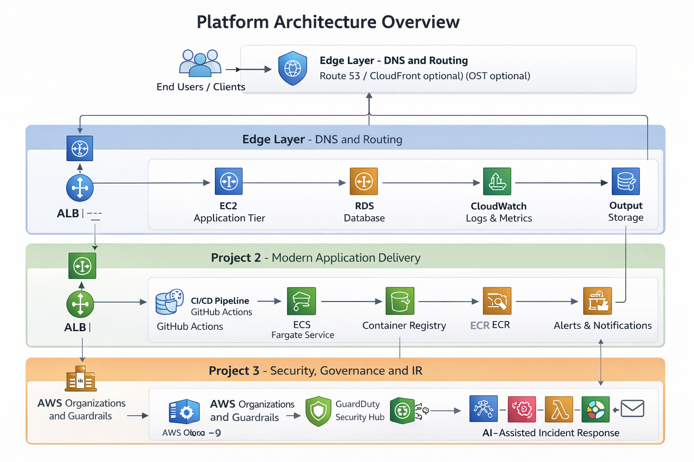

# Cloud Engineering Portfolio — RSVP Multi-Project AWS Platform

A three-project, production-style cloud platform demonstrating end-to-end cloud engineering across infrastructure, application delivery, multi-account governance, cost control, and AI-assisted operations.

This portfolio covers the full lifecycle expected of a modern Cloud/DevOps/Platform Engineer:

Design → Deploy → Automate → Secure → Scale → Govern

It mirrors real engineering work delivered in enterprise AWS environments.

---

## Business Context

RSVP Society is a modern events and nightlife brand requiring a cloud platform capable of supporting:

- Sudden traffic spikes (RSVP drops, ticket sales, promo pushes)
- Fast updates to web and mobile features
- Strong security posture and cost visibility
- High uptime during peak nightlife/entertainment hours
- Automated insights for logs, alerts, and incidents

This portfolio simulates how a Cloud Engineer would build a scalable, secure, cost-aware platform for a small business growing into enterprise cloud maturity.

---

## What This Portfolio Demonstrates

- Multi-AZ and multi-account AWS architecture
- Infrastructure as Code with Terraform
- Containerization and ECS/Fargate orchestration
- CI/CD automation using GitHub Actions
- Centralized logging, monitoring, and alerting
- GuardDuty, Security Hub, IAM Access Analyzer
- Cost controls, budgets, and anomaly detection
- AI-driven summarization of logs and incidents
- Real-world CloudOps troubleshooting and automation
- Business-aligned engineering decisions

---

## Project Index

| Project | Folder | Focus Area | Description |
|--------|--------|------------|-------------|
| Project 1 – RSVP Cloud Platform | [infrastructure/project-1-cloud-platform](./infrastructure/project-1-cloud-platform) | Infrastructure Layer | VPC, ALB, EC2 Auto Scaling, RDS, CloudWatch, AI log summarization |
| Project 2 – Container Platform & CI/CD | [infrastructure/project-2-ecs-cicd](./infrastructure/project-2-ecs-cicd) | Application Delivery Layer | Docker + ECS Fargate + GitHub Actions CI/CD |
| Project 3 – Multi-Account Security & AI Incident Response | [infrastructure/project-3-cloud-governance](./infrastructure/project-3-cloud-governance) | Enterprise Layer | Organizations, SCPs, Identity Center, GuardDuty, Security Hub, Budgets, AI incident assistant |

Each project builds on the previous one, creating a cohesive system that evolves from infrastructure → application delivery → enterprise governance.

---

## Architecture Overview

The RSVP platform uses a layered architecture that reflects real-world AWS cloud maturity stages — progressing from foundational infrastructure, to modern application delivery, to enterprise-grade security and governance.

### Platform Architecture Diagram

This platform architecture illustrates how the three projects operate together as a cohesive system:

- **Project 1** establishes foundational infrastructure, networking, and observability
- **Project 2** introduces modern containerized application delivery with CI/CD automation
- **Project 3** centralizes security, governance, cost controls, and AI-assisted incident response

### 1. Infrastructure Layer (Project 1)

Folder: `infrastructure/project-1-cloud-platform`

Core components:

- Multi-AZ VPC (public + private subnets)
- Application Load Balancer
- EC2 Auto Scaling Group
- RDS MySQL in private subnets
- NAT Gateway, Internet Gateway, and custom route tables
- CloudWatch metrics, dashboards, and alarms
- CloudWatch → SNS → Lambda → LLM → S3 AI Ops pipeline

This layer provides the reliable base for application workloads.

---

### 2. Application Delivery Layer (Project 2)

Folder: `infrastructure/project-2-ecs-cicd`

Modernized application deployment:

- Dockerized RSVP web application
- Amazon ECR for container images
- ECS Fargate service behind a load balancer
- GitHub Actions CI/CD pipeline: build → test → scan → push → deploy
- Rolling deployments for zero downtime

This layer speeds up development cycles and standardizes deployment workflows.

---

### 3. Enterprise Security & Operations Layer (Project 3)

Folder: `infrastructure/project-3-cloud-governance`

Governance and operations capabilities:

- AWS Organizations with multiple accounts (Security, Dev, Prod)
- Service Control Policies (SCPs) for guardrails
- IAM Identity Center (SSO + permission sets)
- GuardDuty, Security Hub, IAM Access Analyzer
- AWS Budgets and Cost Anomaly Detection
- AI Incident Assistant generating human-readable security summaries

This layer represents the maturity expected of enterprise cloud operations.

---

## How the Projects Work Together

| Layer | Project | What It Delivers | Why It Matters |
|-------|---------|------------------|----------------|
| Infrastructure | Project 1 | VPC, compute, database, observability, AI log summaries | Foundation for reliable, scalable workloads |
| Application Delivery | Project 2 | Containers, ECS, CI/CD pipeline | Faster, safer deployments with modern tooling |
| Enterprise Security | Project 3 | Multi-account structure, guardrails, budgets, AI incident analysis | Governance, compliance, operational readiness |

The combined platform demonstrates both technical capability and business alignment, which is essential in cloud engineering roles.

---

## Cost Optimization Strategy

This platform was designed to be realistic and cost-effective for a small-to-mid sized business:

- Right-sized compute (EC2 Auto Scaling + minimal Fargate tasks)
- RDS in private subnets for secure, managed storage
- Infrastructure as Code enables creating/destroying environments on demand
- Budgets and anomaly detection prevent runaway spend
- NAT and data transfer minimized where possible

Cost is treated as an engineering constraint from day one.

---

## Future Enhancements

### Serverless Workflows and APIs

- API Gateway + Lambda microservices
- EventBridge event-driven architecture
- Step Functions for workflow orchestration

### Infrastructure Testing and Policy as Code

- Terratest for infrastructure validation
- Checkov or OPA for compliance enforcement
- Pre-commit hooks to prevent misconfigurations

### GitOps and Environment Automation

- ArgoCD or Flux for declarative deployments
- Git-driven promotion across dev → staging → prod
- Automated drift detection

### AI-Powered Cloud Operations Dashboard

- Unified view of health, spend, alerts, and incidents
- Natural language queries across logs and metrics
- Integrated AI remediation suggestions

---

## Contact

Josh Holman  
Cloud Engineer • Network Engineer • DevOps Practitioner  

LinkedIn: https://www.linkedin.com/in/jnholmanjr/  
Email: jnholman@charter.net
