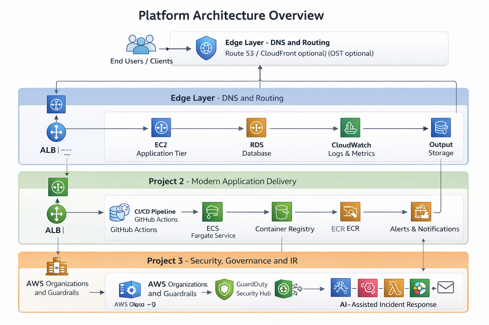

# Cloud Engineering Portfolio — RSVP Multi-Project AWS Platform

A three-part AWS portfolio built with **Terraform** to show how I approach cloud infrastructure, application delivery, and governance/ops. It's a **production-style lab**: deployable, verifiable, and designed to be torn down cleanly to control cost.

This repo is organized as:

**Build → Deploy → Operate**

---

## Business context (why this platform exists)

RSVP Society is an events/nightlife brand. A platform like this needs to handle:
- traffic spikes around promos and event drops
- frequent application updates
- clear visibility into outages and errors
- basic security hygiene and cost awareness

The goal here is not to claim "enterprise scale." The goal is to show **real AWS patterns**, with **proof in Terraform, workflows, and screenshots**.

---

## What this portfolio demonstrates (implemented vs planned)

### Implemented in this repo
- **Terraform IaC** for AWS infrastructure
- **Multi-AZ networking patterns** (public/private subnets, routing, demo/production toggle)
- **EC2 + ALB + Auto Scaling + RDS** (Project 1)
- **ECS Fargate delivery** with **ECR** and SHA-pinned immutable images (Project 2)
- **GitHub Actions pipeline** with OIDC auth that builds, pushes to ECR, registers a new task definition revision with the SHA-tagged image (injected into `APP_VERSION`), and deploys via ECS rolling update (Project 2)
- **End-to-end AI log summarization pipeline** (Project 1):
  **CloudWatch Agent → log group → Alarm State Change (EventBridge) → Lambda → OpenAI → S3 + DynamoDB → SNS**
- **Working security services** (Project 3): GuardDuty, Security Hub, AWS Config (3 rules), CloudTrail
- **AI incident response workflow** (Project 3): GuardDuty finding → EventBridge → Lambda → OpenAI → DynamoDB + SNS
- **AI cost analysis** (Project 3): Weekly schedule → Lambda → Cost Explorer → OpenAI → DynamoDB
- **Dashboard API** (Project 3): API Gateway + Lambda serving incident/cost data from DynamoDB
- **Portfolio dashboard** (Project 3): S3 static site with sample data (clearly labeled in UI)

### Planned / partial (not counted as delivered yet)
- True **multi-account** structure (Security/Dev/Prod) with Organizations, SCPs, IAM Identity Center
- Live data in dashboard (Project 3 — currently sample data)
- Tests/scans in CI/CD (Project 2)

---

## Project index

| Project | Folder | Focus | What it does |
|---|---|---|---|
| Project 1 — RSVP Cloud Platform | [`infrastructure/project-1-cloud-platform`](./infrastructure/project-1-cloud-platform) | Infrastructure | VPC, ALB, EC2 Auto Scaling, RDS, CloudWatch alarms + AI log summary pipeline |
| Project 2 — Container Platform & CI/CD | [`infrastructure/project-2-ecs-cicd`](./infrastructure/project-2-ecs-cicd) | Delivery | Docker + ECR + ECS Fargate behind ALB + GitHub Actions (SHA-pinned rolling deploys) |
| Project 3 — Security Governance & AI Lab | [`infrastructure/project-3-cloud-governance`](./infrastructure/project-3-cloud-governance) | Governance/Ops | Security services + AI incident/cost analysis + dashboard (single-account lab) |

Each project stands alone, but together they show a realistic progression from **infrastructure** → **delivery** → **governance/ops**.

---

## Architecture overview



### Layer 1 — Infrastructure (Project 1)
Core components:
- VPC across 2 AZs (public + private subnets)
- Internet Gateway + optional NAT Gateway (`enable_nat_gateway` toggle)
- ALB + target groups
- EC2 Auto Scaling Group (public subnets in demo mode, private with NAT enabled)
- RDS MySQL (always private subnets)
- CloudWatch alarms + SNS notifications
- **AI log summarization pipeline**:
  - EC2 instances ship Apache logs to CloudWatch via CloudWatch Agent
  - Trigger: CloudWatch Alarm State Change → EventBridge
  - Lambda pulls recent log lines from the app log group
  - Lambda calls OpenAI and writes a JSON summary to S3, metadata to DynamoDB, and publishes a short alert to SNS

### Layer 2 — Application Delivery (Project 2)
Core components:
- Dockerized web app (single-stage, Python + Flask + gunicorn)
- ECR repository with SHA-tagged immutable images
- ECS Fargate service behind an ALB (public subnets in demo mode)
- GitHub Actions workflow (OIDC auth, `workflow_dispatch` trigger):
  - Build image with Git SHA tag
  - Push to ECR
  - Download current task definition, update image + inject SHA into `APP_VERSION`
  - Register new revision, update ECS service, wait for stability (rolling update)

### Layer 3 — Governance / Ops (Project 3)
What's deployed (single-account lab):
- GuardDuty, Security Hub, AWS Config (3 rules), CloudTrail → S3
- AI incident Lambda: GuardDuty → EventBridge → Lambda → OpenAI → DynamoDB + SNS
- AI cost Lambda: Weekly EventBridge → Lambda → Cost Explorer → OpenAI → DynamoDB
- Dashboard API: API Gateway v2 + Lambda → DynamoDB
- Static portfolio dashboard on S3 (sample data)

What's modeled (not provisioned):
- Multi-account Organizations structure (metadata-only CloudFormation stack)
- SCPs, IAM Identity Center, Budgets, Cost Anomaly Detection

---

## How to run this repo

Each project has its own README with exact commands and verification steps:
- Project 1 README: deploy/verify/destroy + AI summary evidence
- Project 2 README: deploy/verify + workflow reference
- Project 3 README: what's deployed vs modeled + evidence

---

## Operational notes (what I'm optimizing for)

This platform is written with an operator mindset:
- clear "verify health" checks (ALB target health, ECS service health, RDS status, alarms)
- screenshots that prove the environment exists
- destroy paths to prevent runaway spend

---

## Cost awareness (high-level)

Typical cost drivers in these projects:
- NAT Gateway hourly + data processing (only when enabled)
- ALB hourly + LCUs
- ECS task CPU/memory-hours
- RDS instance + storage + backups
- CloudWatch log ingestion + retention
- GuardDuty, Security Hub, Config (Project 3)
- AI analysis runs only on events and schedules (event-driven, minimal cost)

---

## Validation

Checks run against this repo:

```bash
# Terraform formatting and syntax
terraform fmt -check -recursive infrastructure/
terraform validate                  # per-project (requires init)

# Python syntax
python3 -m py_compile infrastructure/project-1-cloud-platform/ai_log_summarizer.py
python3 -m py_compile infrastructure/project-3-cloud-governance/security/ai_cost_lambda.py
python3 -m py_compile infrastructure/project-3-cloud-governance/security/ai_incident_lambda.py
python3 -m py_compile infrastructure/project-3-cloud-governance/workload/dashboard_api.py
python3 -m py_compile infrastructure/project-2-ecs-cicd/app/app.py

# Container build
cd infrastructure/project-2-ecs-cicd/app && docker build -t rsvp-test .
```

---

## Known limitations

Documented here so reviewers see controlled scope, not gaps:

- **Project 1:** Demo mode (default) places EC2 in public subnets. Set `enable_nat_gateway = true` for private-subnet production architecture.
- **Project 2:** ECS tasks run in public subnets with public IPs in demo mode. Production would use private subnets with NAT or VPC endpoints.
- **Project 3:** Multi-account organization, SCPs, IAM Identity Center, Budgets, and Cost Anomaly Detection are modeled and documented but not provisioned as Terraform resources. The dashboard renders sample data; live API integration is planned.
- **Project 3:** AI cost Lambda falls back to sample data if Cost Explorer is not enabled in the AWS account.

---

## Future enhancements (kept separate on purpose)

- Multi-stage Docker build for smaller image (Project 2)
- Container image scanning in CI/CD (Project 2)
- Multi-account Organizations buildout with SCPs and Identity Center (Project 3)
- Wire dashboard to live API data (Project 3)
- Ticket/Slack integration for incident summaries
- Policy-as-code and IaC testing

---

## Contact

Josh Holman
Infrastructure Engineer • Cloud Operations

LinkedIn: https://www.linkedin.com/in/jnholmanjr/
Email: jnholman@charter.net
