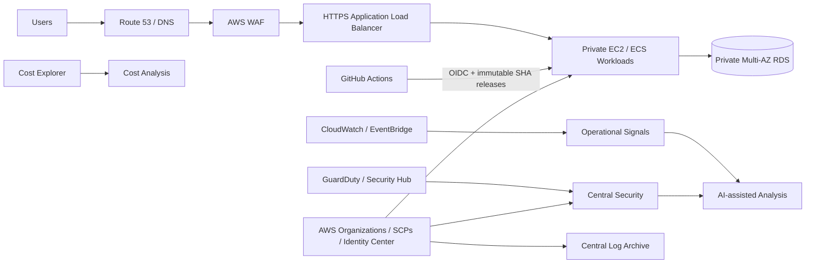

# RSVP Cloud Platform

**An AWS engineering platform that grew out of a real business migration and became a deeper study of cloud networking, infrastructure automation, delivery, security, reliability, and operations.**

## Where this came from

RSVP Cloud Platform started because I wanted to move **RSVP Society, a private-event business I run, onto AWS**.

My first approach was much heavier than the business actually needed. I had built the kind of three-tier architecture that shows up in a lot of cloud projects — VPCs, public and private subnets, load balancing, compute, and a relational database — and then kept adding the controls I was learning around it.

As RSVP Society became a real operating system for the business, the mismatch became obvious. The right answer was not to force enterprise-sized infrastructure onto a small workload just because I had already built it. I simplified RSVP Society around its real requirements and separated this project from it.

I kept RSVP Cloud Platform for a different reason: **to push past the point where a normal AWS tutorial stops** and work through the problems I expect to face as I move from enterprise network engineering into cloud networking, infrastructure automation, and cloud operations.

That is why this repository is intentionally broader than the infrastructure RSVP Society needs. The extra depth has a purpose: learn the technology, understand the trade-offs, connect it to problems I have already handled in network operations, and be able to explain how I would use it at a larger scale.

## What problems am I working through?

My network background shapes how I look at cloud infrastructure. I am less interested in whether I can create an AWS resource than in what happens when traffic, changes, dependencies, security controls, or recovery procedures fail.

| Problem | How this platform approaches it | Why it matters |
|---|---|---|
| Too much infrastructure is directly exposed | Public edge, private application/database tiers, security-group boundaries, HTTPS and WAF | Reduces attack surface and makes the traffic path intentional |
| Infrastructure changes are manual or inconsistent | Terraform, environment-specific configuration, remote state and reviewable changes | Makes infrastructure repeatable and easier to audit |
| Deployment credentials become another secret to manage | GitHub Actions uses AWS OIDC and environment-scoped roles | Removes long-lived AWS deployment keys from GitHub |
| A bad release reaches production | Immutable Git-SHA images, pre-deploy checks, health validation and ECS rollback | Reduces change risk and gives releases a known recovery path |
| An outage starts with "what actually failed?" | CloudWatch metrics, logs, alarms, dashboards, EventBridge/SNS and bounded AI analysis | Gives operators evidence before they start troubleshooting |
| One workload or administrator has too much blast radius | AWS Organizations, separate security/logging responsibilities, SCPs and Identity Center | Separates duties and protects central controls |
| Backups exist but recovery is assumed | Multi-AZ design, RDS PITR/AWS Backup and recovery validation | Treats recoverability as something to test, not something to assume |
| Reliability controls can become expensive | Autoscaling, environment-specific sizing, Cost Explorer analysis and explicit trade-offs | Keeps technical design connected to business cost |

## Platform at a glance

```mermaid
flowchart LR
    U[Users] --> DNS[Route 53 / DNS]
    DNS --> WAF[AWS WAF]
    WAF --> ALB[HTTPS Application Load Balancer]

    ALB --> APP[Private EC2 / ECS Workloads]
    APP --> DB[(Private Multi-AZ RDS)]

    GH[GitHub Actions] -->|OIDC + immutable SHA releases| APP

    CW[CloudWatch / EventBridge] --> OPS[Operational Signals]
    GD[GuardDuty / Security Hub] --> SEC[Central Security]
    CE[Cost Explorer] --> FIN[Cost Analysis]

    OPS --> AI[AI-assisted Analysis]
    SEC --> AI

    ORG[AWS Organizations / SCPs / Identity Center] --> SEC
    ORG --> LOG[Central Log Archive]
    ORG --> APP
```

### In plain English

Internet traffic terminates at a protected HTTPS edge. The application runs in private subnets and only accepts the traffic path it expects. The database is private and only accepts application-tier traffic.

Infrastructure is defined in Terraform. Application releases move through GitHub Actions using short-lived AWS credentials and immutable container versions. Monitoring, security findings, backups, and recovery controls are treated as part of the platform rather than something added after the application works.

The multi-account layer separates workload, security, and logging responsibilities. AI is used only as an analysis layer over approved operational evidence; it is not allowed to make infrastructure changes.

## Why this goes beyond a three-tier AWS project

The three-tier portion is only the starting point.

A VPC, load balancer, compute tier, and database show that an application can be hosted. They do not answer how the environment is operated after that. This project continues into the areas that become important when more people, more changes, more accounts, and more failure modes are involved:

- controlled container delivery and rollback
- CI security and quality gates
- short-lived deployment authentication
- observability and incident evidence
- tested recovery paths
- centralized security findings
- multi-account governance and policy guardrails
- identity and permission boundaries
- cost visibility
- bounded use of AI in operational workflows

The point is not to use the most AWS services possible. The point is to understand **when these controls solve a real problem, what they cost, and what I would leave out when the requirements do not justify them**.

## The three engineering layers

### 1. Cloud foundation

The first layer translates familiar network and infrastructure concerns into AWS:

- multi-AZ VPC with public edge and private workload/database subnets
- EC2 Auto Scaling behind an HTTPS Application Load Balancer
- security-group-to-security-group traffic boundaries
- NAT Gateway per Availability Zone for resilient private egress
- private Multi-AZ RDS MySQL with KMS encryption
- RDS-managed credentials in Secrets Manager
- point-in-time recovery, AWS Backup and final-snapshot protection
- CloudWatch dashboards, logs, alarms and notifications
- WAF managed protections and rate limiting

This is the part closest to my networking background: traffic paths, segmentation, failure domains, least exposure, monitoring, and recovery.

### 2. Container delivery and infrastructure automation

The second layer focuses on how changes safely reach a running service:

- Dockerized Python/Flask workload
- ECR with immutable image handling
- ECS Fargate across Availability Zones
- CPU and memory autoscaling
- GitHub Actions authenticated to AWS through OIDC
- environment-scoped deployment roles
- immutable Git-SHA releases instead of `latest`
- pre-deployment tests and vulnerability scanning
- HTTPS smoke testing after deployment
- automatic rollback to the previous ECS task definition on a failed release
- Terraform separated from application release ownership so an infrastructure-only change does not roll the application backward

That last point matters. Terraform owns the platform baseline; the release workflow owns application revisions. The two should not fight each other.

### 3. Governance, security and operations

The third layer asks what changes when one workload becomes several environments or accounts:

- AWS Organizations and organizational units
- Service Control Policies protecting central security controls
- Security and Log Archive account patterns
- delegated GuardDuty, Security Hub and AWS Config administration
- organization-wide CloudTrail
- IAM Identity Center permission sets
- authenticated operations API with Cognito MFA
- centralized operational/security data access with scoped cross-account roles
- Cost Explorer-backed FinOps analysis
- AI-assisted SRE and security triage with deterministic guardrails and fallback behavior

The governance code is intentionally split into multiple Terraform roots because the management, security, log archive, and workload accounts do not share the same trust boundary.

## Decisions and trade-offs

| Decision | Why I made it | What I accept in return |
|---|---|---|
| Private workloads behind a public edge | Keeps direct exposure limited to managed ingress | More networking components and private-egress cost |
| NAT Gateway per AZ | Avoids making private egress depend on one Availability Zone | Higher cost than one shared NAT |
| Multi-AZ RDS | Gives the database an availability baseline that matches the production design | Higher steady-state database cost |
| ECS Fargate instead of Kubernetes | Lets me focus on containers, delivery, networking and operations without adding cluster administration that this workload does not need | Less control than a Kubernetes platform |
| OIDC instead of stored AWS keys | Reduces credential lifetime and secret-management risk | Requires stricter trust-policy and GitHub Environment design |
| Immutable SHA releases | Makes a deployed image traceable to source | Requires a deliberate image lifecycle and release process |
| Separate security/logging accounts | Reduces the blast radius of a workload account | Adds account/bootstrap complexity and cross-account trust design |
| Manual Terraform execution | Infrastructure changes remain deliberate and context-aware, especially across multiple accounts | Terraform provider validation is not performed on every ordinary push |
| AI is advisory only | Useful for summarizing evidence and suggesting next checks | A human or deterministic workflow still owns every state-changing action |
| Single-region today | Keeps cost and complexity proportional to the project | Multi-region disaster recovery remains a future business decision |

## AI-assisted operations

I wanted to explore AI where it could actually help operations without pretending it should run the infrastructure.

The platform uses AI for three bounded jobs:

- summarize CloudWatch alarm and log evidence for SRE triage
- analyze Security Hub findings and suggest investigation steps
- explain Cost Explorer data and identify areas worth reviewing

Before external analysis, evidence is limited and sensitive identifiers are redacted or hashed where appropriate. Outputs are schema-checked, confidence is recorded, deterministic fallbacks remain available, and security severity cannot be downgraded below the underlying Security Hub finding.

The AI roles do **not** have permission to terminate instances, resize databases, buy capacity, edit security groups, or perform autonomous remediation.

## How my network-engineering experience carries into this

The tools are different, but many of the engineering questions are not.

In enterprise networking I have had to isolate failures across routing, firewalls, VPNs, DNS, WAN paths, and application dependencies; work through controlled production changes; validate recovery; and use telemetry to prove where a problem is occurring.

I approached this platform the same way:

**understand the traffic path → define the trust boundary → reduce blast radius → make changes repeatable → collect evidence → recover safely.**

The project is my way of extending that operating mindset into AWS, Terraform, containers, CI/CD, cloud security, and platform operations rather than treating cloud as a completely separate discipline.

## Cost and scale

Some of the controls in this repository are deliberately more expensive than the cheapest possible lab: redundant NAT Gateways, Multi-AZ RDS, multiple ECS tasks, WAF, GuardDuty, Security Hub, Config, CloudWatch, backups, and centralized logging all have a cost.

That is part of the exercise.

A technical control has to be justified by the risk or operating problem it solves. A small business workload may not need every control shown here. A larger environment may need even more. The architecture is therefore designed so that the conversation can be about **requirements, risk, reliability, and cost**, not simply about whether a service can be turned on.

At larger scale I would look at reusable platform modules, account vending, stronger workload ownership boundaries, service-level objectives, policy automation, shared-network patterns, and regional disaster recovery when those requirements become real. I would not add Kubernetes, Kafka, Transit Gateway, or multi-region architecture just to make the diagram look more complicated.

## Validation approach

I treat source checks and live AWS behavior as different kinds of evidence.

Repository checks cover Python tests, linting, dependency auditing, infrastructure security scanning, container build/scanning, packaging and structural contracts. Terraform execution remains deliberate rather than automatic.

When the platform is exercised in AWS, the useful evidence is operational: private workload placement, HTTPS/WAF behavior, healthy tasks across Availability Zones, deployment rollback, RDS protection and restore behavior, CloudWatch alarm transitions, centralized security findings, and measured recovery results.

RTO/RPO numbers remain **targets** until a timed recovery exercise produces measurements. I use the same rule for cost, scale, and performance claims: measure first, claim second.

## Repository map

| Area | Purpose |
|---|---|
| `infrastructure/project-1-cloud-platform/` | Network/application foundation, EC2, RDS, monitoring, backup and SRE analysis |
| `infrastructure/project-2-ecs-cicd/` | Container workload, ECS platform, delivery bootstrap and controlled releases |
| `infrastructure/project-3-cloud-governance/` | Organizations, centralized security, log archive, Identity Center, operations API and FinOps |
| `infrastructure/bootstrap-state/` | Remote Terraform state foundation |
| `.github/workflows/` | Automated quality/security checks and controlled ECS delivery |
| `ops/recovery/` | Recovery and resilience validation helpers |
| `docs/ARCHITECTURE.md` | Trust boundaries and deeper architecture notes |
| `docs/DEPLOYMENT.md` | Operational deployment and validation reference |

## Scope and claim boundaries

This is a portfolio-scale engineering platform, not a claim that I have operated this exact design at hyperscale. The value of the project is in the architecture, code, controls, trade-offs, failure handling, and the ability to validate those decisions against real AWS services.

RSVP Society also does not use all of this infrastructure. That separation is intentional. One of the most useful lessons from building the original version was learning that **good engineering is not adding every control you know — it is knowing which controls the workload actually needs.**

---

**Josh Holman**  
Network / Cloud Infrastructure Engineer  
AWS • Terraform • Python • GitHub Actions • Cisco • Palo Alto
