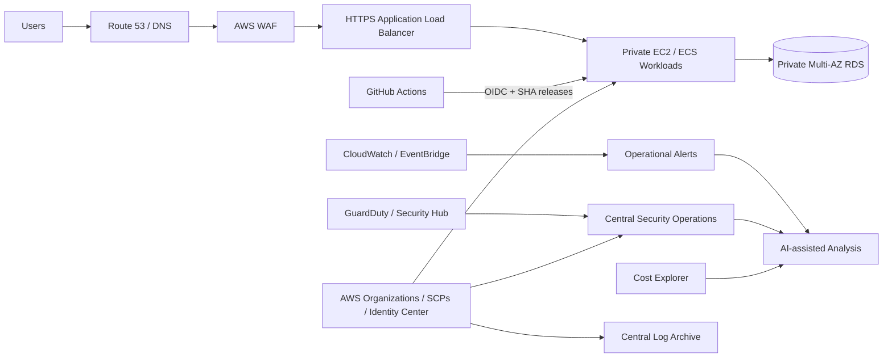

# RSVP Enterprise Cloud Platform

**A secure, automated AWS application platform built with Terraform, GitHub Actions, centralized governance, observability, recovery controls, and AI-assisted operations.**

This project demonstrates how I would move a workload from basic cloud infrastructure to a repeatable operating model that can be deployed, secured, monitored, and recovered with less manual work.

It is designed as a **portfolio-scale implementation of enterprise patterns**. The goal is not to claim hyperscale production traffic; the goal is to show the architecture, automation, security controls, tradeoffs, and operational thinking behind a production AWS platform.

## What problem does it solve?

A modern application needs more than servers and a database. It needs a consistent way to answer questions such as:

- How do we keep workloads private while still serving users securely?
- How do we deploy changes without using long-lived AWS credentials?
- What happens when a bad release reaches production?
- How do security teams enforce controls across multiple AWS accounts?
- How do operators know when the application, database, or infrastructure is unhealthy?
- How do we recover from failures and prove that backups work?
- Where can AI reduce triage effort without being allowed to make risky infrastructure changes?

RSVP Enterprise Cloud Platform addresses those concerns as one connected platform rather than as isolated AWS demos.

## Platform at a glance

```mermaid
flowchart LR
    U[Users] --> DNS[Route 53 / DNS]
    DNS --> WAF[AWS WAF]
    WAF --> ALB[HTTPS Application Load Balancer]

    ALB --> APP[Private EC2 / ECS Workloads]
    APP --> DB[(Private Multi-AZ RDS)]

    GH[GitHub Actions] -->|OIDC + SHA releases| APP

    CW[CloudWatch / EventBridge] --> OPS[Operational Alerts]
    GD[GuardDuty / Security Hub] --> SEC[Central Security Operations]
    OPS --> AI[AI-assisted Analysis]
    SEC --> AI
    CE[Cost Explorer] --> AI

    ORG[AWS Organizations / SCPs / Identity Center] --> SEC
    ORG --> LOG[Central Log Archive]
    ORG --> APP
```

### The design in plain English

Traffic enters through a protected HTTPS endpoint. Application workloads remain in private subnets and reach a private, encrypted database. Software is deployed through GitHub Actions using short-lived AWS credentials and immutable image versions. Security and audit controls are centralized across AWS accounts. CloudWatch, GuardDuty, Security Hub, backups, and recovery procedures provide the operating layer. AI analyzes approved evidence and recommends actions, but **does not autonomously modify infrastructure**.

## What is implemented

### 1. Production network and application foundation

- Multi-AZ VPC design with public edge subnets and private workload subnets
- EC2 Auto Scaling and ECS Fargate workloads without public IP addresses
- NAT Gateway per Availability Zone for resilient private egress
- HTTPS with ACM certificates and HTTP-to-HTTPS redirect
- AWS WAF managed rules and rate limiting
- Security groups that restrict application access to the load balancer path

### 2. Resilient data layer

- Private Amazon RDS MySQL
- Multi-AZ deployment
- KMS encryption and key rotation
- AWS-managed master password in Secrets Manager
- point-in-time recovery and backup retention
- deletion protection and required final snapshots
- storage autoscaling and database monitoring

### 3. Container delivery and CI/CD

- Dockerized Python/Flask application running as a non-root container
- ECS Fargate service distributed across Availability Zones
- service autoscaling and deployment circuit breaker
- GitHub Actions authentication through AWS OIDC — no long-lived deployment keys
- immutable Git SHA image releases
- automated Ruff, pytest, dependency-audit, Checkov, Docker-build, and Trivy gates; Terraform/TFLint validation remains manual-only
- post-deployment HTTPS health verification
- automatic rollback to the previous ECS task definition when validation fails

### 4. Multi-account governance

- AWS Organizations with Security, Infrastructure, Workloads, NonProd, and Prod organizational units
- optional account creation with a safe default that does not automatically create AWS accounts
- root-level member-account protection plus Service Control Policies protecting CloudTrail, Config, GuardDuty, and Security Hub
- delegated GuardDuty, Security Hub, AWS Config, and CloudFormation StackSets administration
- dedicated Security and Log Archive account patterns
- organization-wide multi-Region CloudTrail with log-file validation
- organization AWS Config aggregation for member accounts where Config recording is enabled
- IAM Identity Center permission sets for administrators, operators, and read-only engineering access

### 5. API and edge security

- Regional API Gateway REST API protected by AWS WAF
- Amazon Cognito authentication with software-token MFA
- restrictive CORS configuration
- throttling and bounded Lambda concurrency
- X-Ray tracing and structured API access logging
- scoped cross-account read roles and Lambda permissions

### 6. Observability and recovery

- CloudWatch dashboards for application, ECS, EC2, ALB, and RDS health
- alarms for 5XX errors, unhealthy targets, CPU, memory, and database storage
- SNS operational notifications
- customer-managed KMS key on the AWS Backup vault plus scheduled RDS backups; RDS recovery points inherit the database encryption key
- Project 1 recovery KMS keys have intentional Terraform destruction guards so retained snapshots and recovery points cannot be orphaned by routine stack teardown
- RDS point-in-time recovery validation workflow
- ECS resilience validation workflow
- recovery validation scripts and a single deployment/validation guide
- explicit RTO/RPO **targets** that must be measured during recovery testing before being claimed as achieved

### 7. AI-assisted operations

AI is deliberately a supporting capability rather than the platform's control plane.

- SRE analysis uses bounded CloudWatch evidence and returns likely cause, impact, recommended checks, evidence used, and confidence
- Security triage consumes centralized Security Hub findings and assigns operational priority
- FinOps analysis uses real AWS Cost Explorer data
- OpenAI credentials are stored in AWS Secrets Manager
- deterministic fallback behavior exists when AI is unavailable
- retries, dead-letter queues, concurrency controls, evidence storage, and operational metrics are included
- AI has no permissions to terminate, resize, purchase, or autonomously remediate AWS infrastructure

## Why these choices matter

| Decision | Reason |
|---|---|
| Private application subnets | Reduces direct internet exposure and creates a controlled network path. |
| NAT per AZ | Costs more than a single NAT Gateway, but removes a single-AZ egress dependency for production workloads. |
| Multi-AZ RDS | Accepts additional database cost in exchange for higher availability. |
| OIDC for GitHub Actions | Avoids storing long-lived AWS deployment credentials in GitHub. |
| Immutable SHA image tags | Makes every release traceable and prevents accidental reuse of `latest`. |
| ECS circuit breaker + health validation | Makes failed deployments detectable and recoverable. |
| Separate security/logging responsibilities | Reduces the blast radius of one compromised workload account. |
| AI advisory only | Uses AI to reduce human analysis time without allowing probabilistic output to control infrastructure. |

## Repository structure

| Area | Purpose |
|---|---|
| `infrastructure/project-1-cloud-platform/` | EC2, ALB, RDS, networking, monitoring, backups, and SRE AI workflow |
| `infrastructure/project-2-ecs-cicd/` | Container application, ECS platform, autoscaling, WAF, and deployment automation |
| `infrastructure/project-3-cloud-governance/` | Organizations, security administration, log archive, Identity Center, secure API, and FinOps AI |
| `infrastructure/bootstrap-state/` | Remote Terraform state foundation |
| `.github/workflows/` | CI validation and controlled ECS deployment workflows |
| `ops/` | Recovery validation scripts |
| `docs/` | Architecture and deployment/validation guidance |

## Terraform environment model

The infrastructure is separated into `dev`, `stage`, and `prod` configuration examples with remote S3 state, an explicit customer-managed KMS key for backend writes, and DynamoDB locking. Multi-account governance roots use account-local state backends by default so member accounts are not implicitly granted access to a management-account state bucket. The environments share the same engineering patterns while allowing capacity, protection, and cost settings to differ.

The governance layer is intentionally deployed in stages because AWS Organizations should not be treated as if one Terraform execution can safely create an organization, create accounts, and immediately administer every new account.

## Cost and scale considerations

This design chooses production resilience over minimum lab cost in several areas. NAT Gateways, Multi-AZ RDS, WAF, GuardDuty, Security Hub, AWS Config recording where enabled, CloudWatch, and multiple running ECS tasks all create real AWS charges.

For a temporary demonstration environment, deploy only the controls needed for the evidence being captured and remove expendable workload resources afterward. Remote-state, centralized audit, and Project 1 recovery KMS keys have intentional Terraform destruction guards; do not treat them as disposable demo resources. A complete teardown requires deliberate operator action only after the dependent state, snapshots, and recovery points have been removed or no longer need to be recoverable. For production, the high-value security, logging, backup, and availability controls should remain enabled.

At greater organizational scale, I would extend this design with account vending, reusable platform modules, standardized deployment templates, stronger workload ownership boundaries, regional disaster recovery, service-level objectives, and organization-wide policy automation rather than simply adding more AWS services.

## Validation status

The repository has passed the local code and contract audit. Normal GitHub CI runs application tests, dependency/security checks, container build validation, and vulnerability scanning. Terraform execution is intentionally manual-only.

Real AWS deployment evidence is still required before describing the platform as fully validated in production-like conditions. The deployment, recovery, and evidence procedure lives in [`docs/DEPLOYMENT.md`](docs/DEPLOYMENT.md), not in this front-page overview.

## Known limitations

- This is a portfolio-scale implementation of enterprise AWS patterns, not a claim that the environment has served enterprise production traffic.
- Multi-account AWS services create real cost, so account-level controls may be provisioned only during controlled validation exercises.
- RTO/RPO values are engineering targets until a timed recovery exercise proves them.
- IAM Identity Center must exist before Terraform can create permission sets and account assignments.
- Existing AWS accounts should be imported or migrated deliberately; the Terraform code does not silently move accounts between OUs.
- Production access, approvals, domain names, account IDs, and alert destinations must be supplied for the target environment rather than committed to the repository.

## Positioning

**Primary story:** cloud architecture, infrastructure automation, security, reliability, observability, and recovery.

**Supporting differentiator:** AI-assisted operations built on top of deterministic AWS controls.

---

**Josh Holman**  
Network / Cloud Infrastructure Engineer  
AWS • Terraform • Python • GitHub Actions • Cisco • Palo Alto
