# Project 1 – RSVP Cloud Platform (Infrastructure Layer)

Project 1 builds the **foundational AWS infrastructure** for the RSVP Society platform: a highly available, secure environment for running a small event-booking / RSVP application with observability and AI-assisted log analysis.

---

## Overview

This project provisions a production-style environment using **Terraform**, including:

- Multi-AZ VPC with public and private subnets  
- Application Load Balancer (ALB)  
- EC2 Auto Scaling Group for the web app  
- RDS MySQL database in private subnets  
- NAT Gateway and Internet Gateway routing  
- Security groups using least-privilege design  
- CloudWatch metrics, dashboards, and alarms  
- SNS notifications for critical alerts  
- AI log summarization pipeline (CloudWatch → SNS → Lambda → LLM → S3/DynamoDB)

This is the kind of baseline environment many businesses migrate to when modernizing a legacy on-prem or single-server app.

---

## 🧱 Architecture Diagram

Below is the high-level architecture for Project 1.

---

## Business Problem

RSVP Society (or any events brand) needs:

- A **reliable, scalable backend** for event discovery, RSVPs, and bookings  
- Protection from **traffic spikes** around big events or promotions  
- Minimal downtime during weekends and peak nightlife hours  
- Faster incident investigation when something goes wrong  

Running a single EC2 instance or a basic VPS is risky: one spike or misconfiguration can take the whole app down. This project solves that by designing a **highly available, observable platform**.

---

## Architecture Decisions

Key design choices:

- **Multi-AZ VPC** for resilience against AZ failures  
- **ALB + Auto Scaling Group** instead of a single EC2 instance  
- **RDS MySQL in private subnets** for managed, durable storage  
- **Public subnets for ALB only**; app and DB stay private  
- **CloudWatch + SNS** to avoid “silent failures”  
- **AI summarization** of logs and alerts to cut down investigation time  

This balances **cost, simplicity, and availability** for a small-to-mid sized business.

---

## Architecture Breakdown

### Networking

- 1 VPC  
- Public subnets (per AZ)  
- Private subnets for app and database tiers  
- Internet Gateway attached to the VPC  
- NAT Gateway in public subnets for outbound access from private subnets  
- Route tables for public and private traffic flows  

### Compute & Load Balancing

- Application Load Balancer (HTTP/HTTPS listener)  
- Target group mapped to EC2 instances in an Auto Scaling Group  
- Auto Scaling policies (min/max/desired) tuned for predictable costs  

### Database

- Amazon RDS MySQL instance  
- Deployed in private subnets  
- Security group allowing only app tier access  
- Backups handled by RDS automated backups

### Observability

- CloudWatch metrics: CPU, RAM (via CloudWatch agent if configured), status checks  
- CloudWatch dashboards for environment health  
- CloudWatch alarms for high CPU, unhealthy hosts, or HTTP 5xx spikes  
- SNS topics and subscriptions for alerting (e.g., email)

### AI Operations Layer

- CloudWatch alarms / log events trigger SNS  
- SNS invokes a Lambda function  
- Lambda calls an LLM (e.g., OpenAI API) with relevant log/alert context  
- AI response is stored in S3 and/or DynamoDB as a **human-readable incident summary**  
  - What happened  
  - Likely root cause  
  - Impact  
  - Suggested next steps  

This turns noisy logs into concise summaries you can quickly act on.

---

## Cost Strategy

Design choices to keep costs reasonable for a small business:

- **Single VPC, single region, multi-AZ** instead of complex multi-region setups  
- **Right-sized ASG** with low minimum instance count  
- **Use of managed RDS** to avoid hidden ops costs of managing databases manually  
- **Alerting before scaling up too far** (e.g., watch CPU over time, not one spike)  
- AI summarization runs **only on alerts/events**, not on every log line.

Terraform also allows the entire stack to be **created, updated, or destroyed** quickly as needed (for demos, tests, or cost savings).

---

### Business Outcomes

- For a business like RSVP Society, this infrastructure:
- Reduces outage risk during peak traffic
- Improves user experience (no random crashes from a single overloaded server)
- Shortens incident investigation time via AI summaries
- Provides a path to scale as the brand grows without rewiring everything

---

### Future Enhancements

Potential improvements:
- Add HTTPS termination on ALB using ACM
- Add WAF rules for basic security protections
- Add SSM Parameter Store/Secrets Manager integration
- Expand AI pipeline to summarize not just logs but performance trends over time
- Integrate with external notification tools (Slack, Teams, etc.)

---

## 📸 Infrastructure Screenshots

Below are visual references showing the AWS resources deployed by this project.

### VPC & Networking
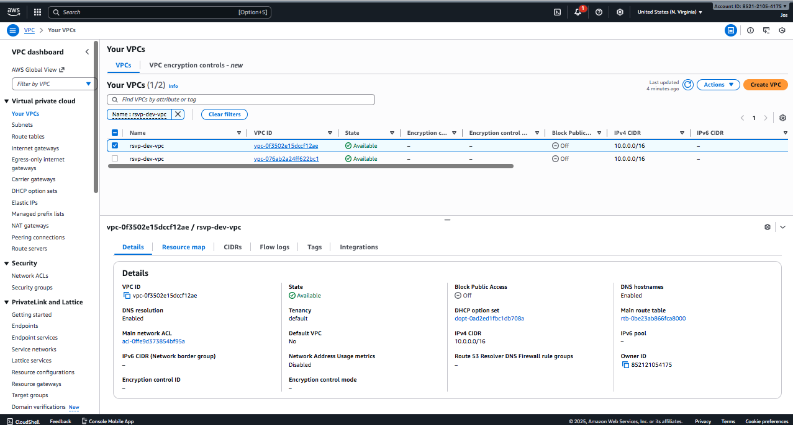
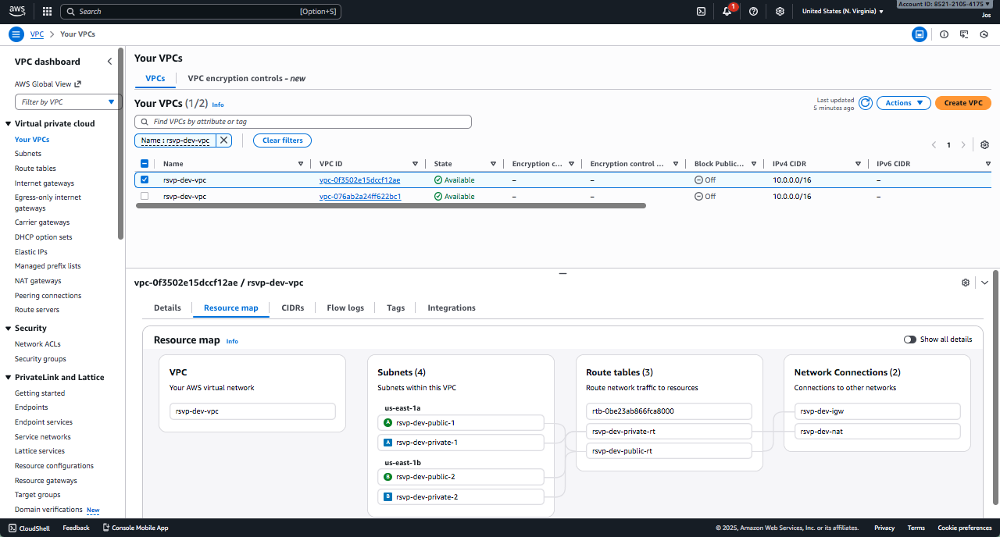
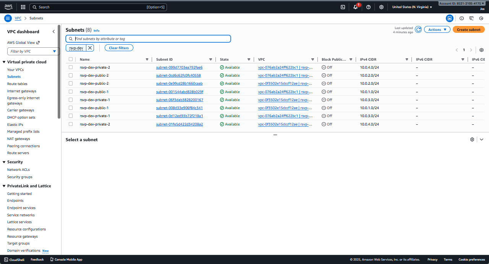

### Load Balancing

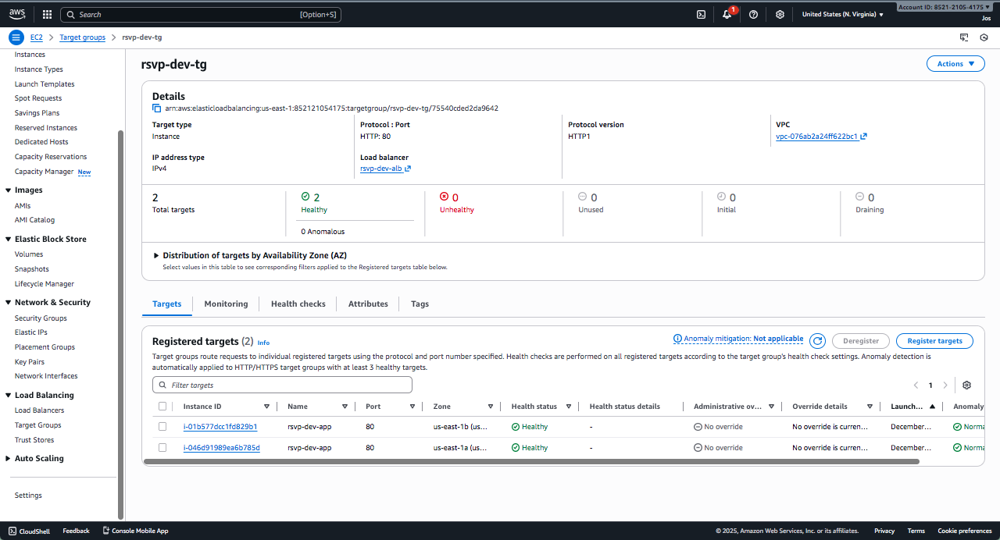

### Compute
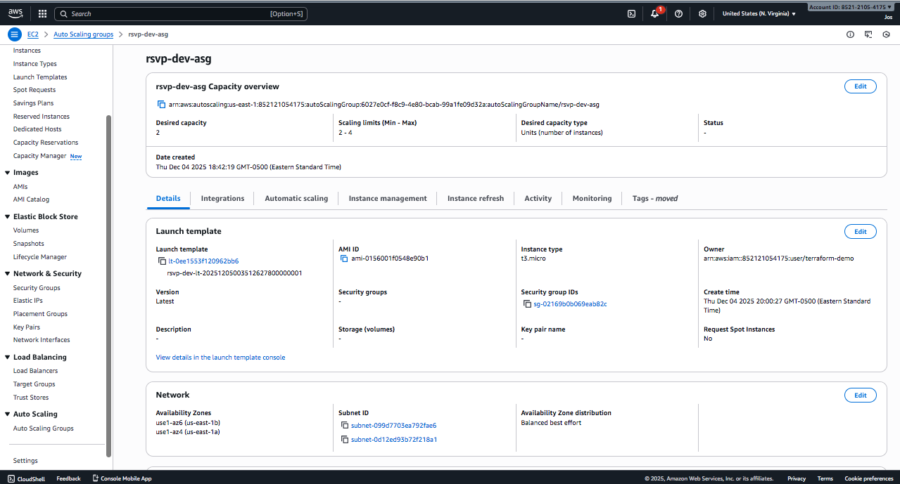

### Database
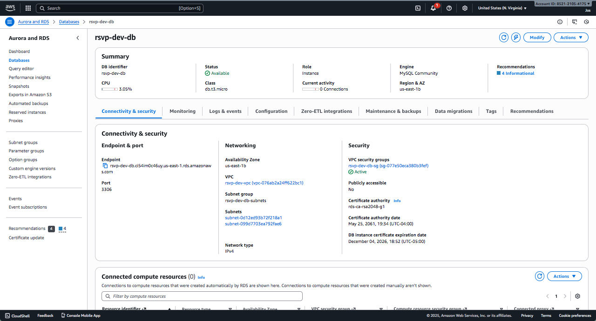

### Monitoring & AI Automation
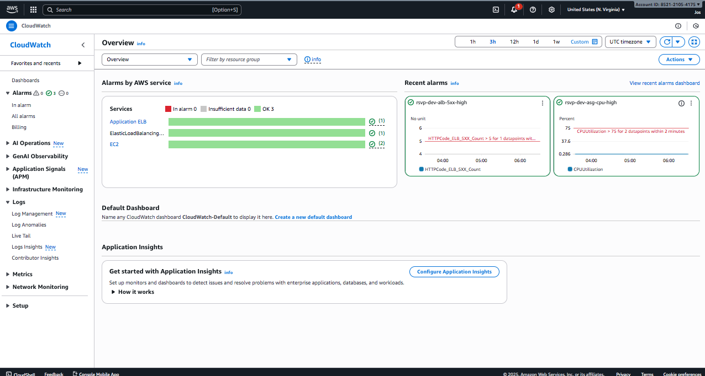
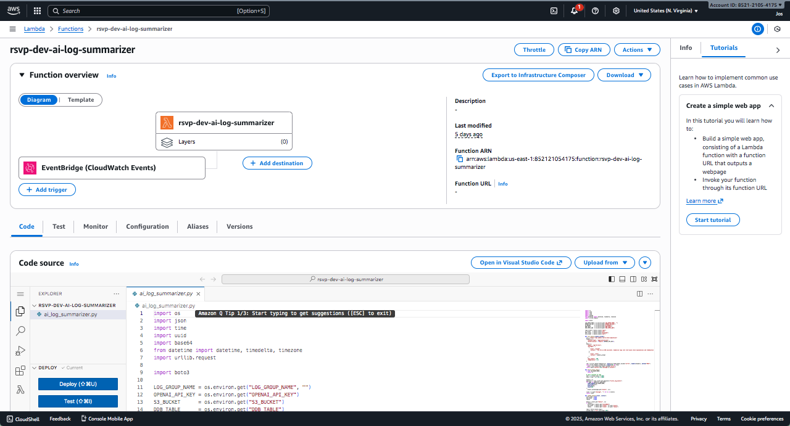

### Storage (AI Log Summaries)
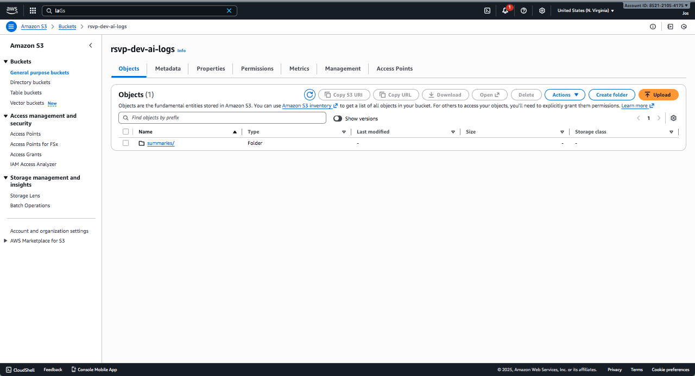
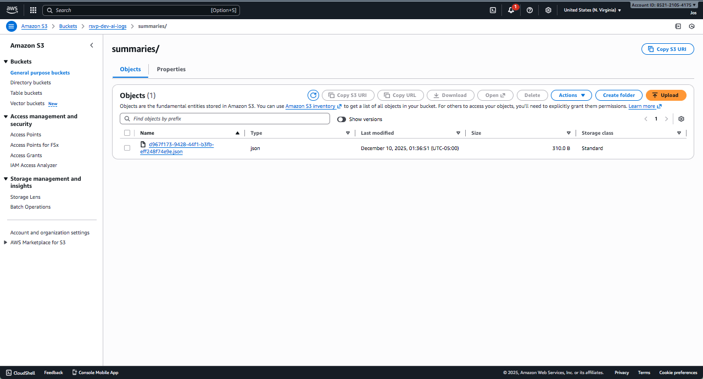

### Application UI
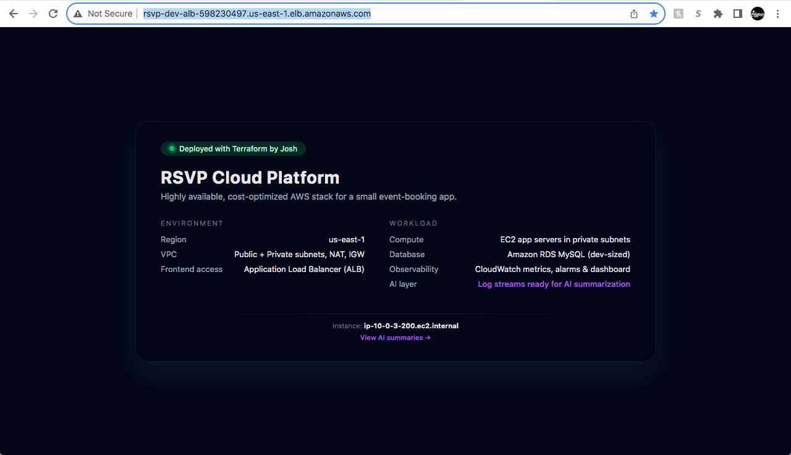
