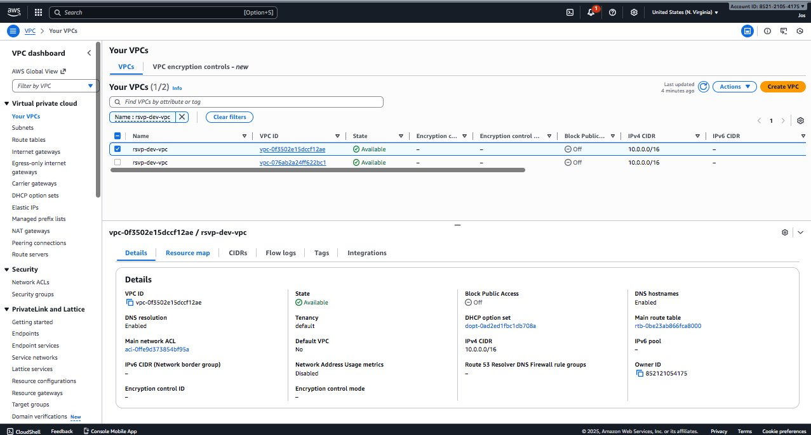
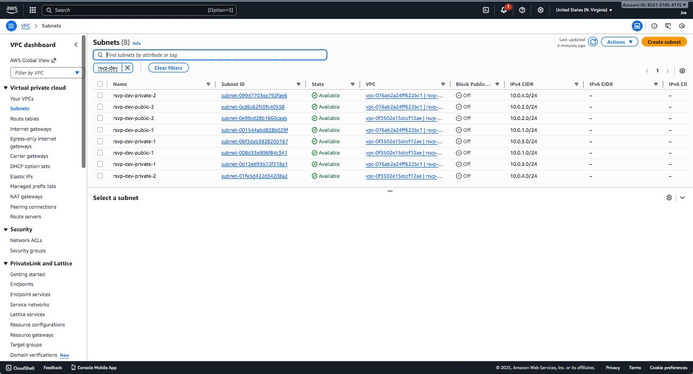
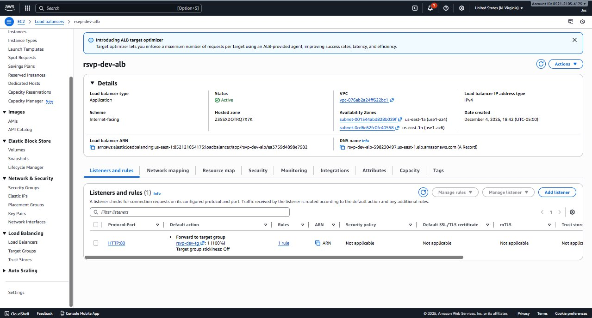
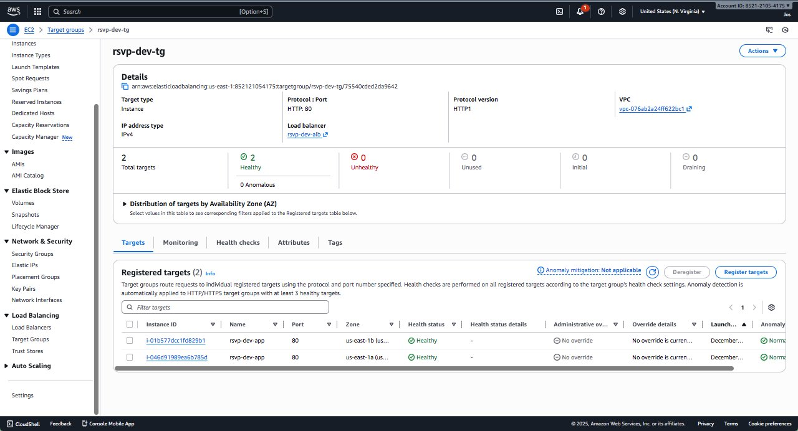
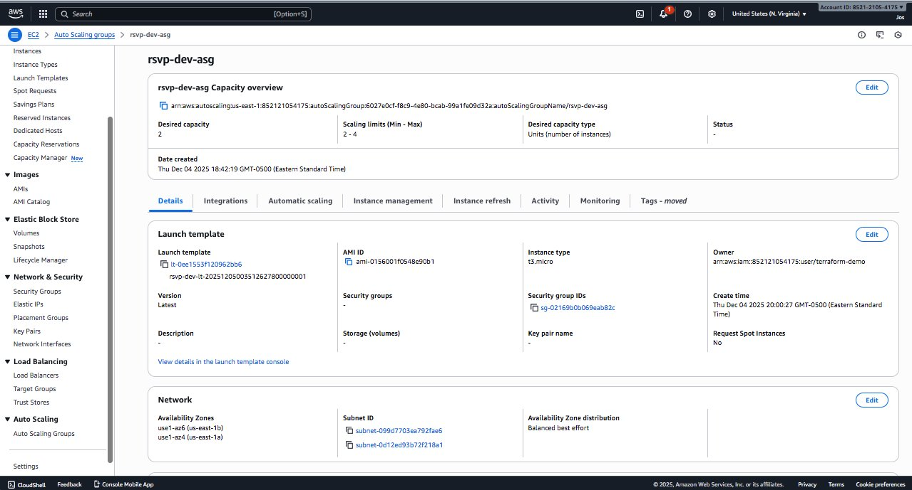
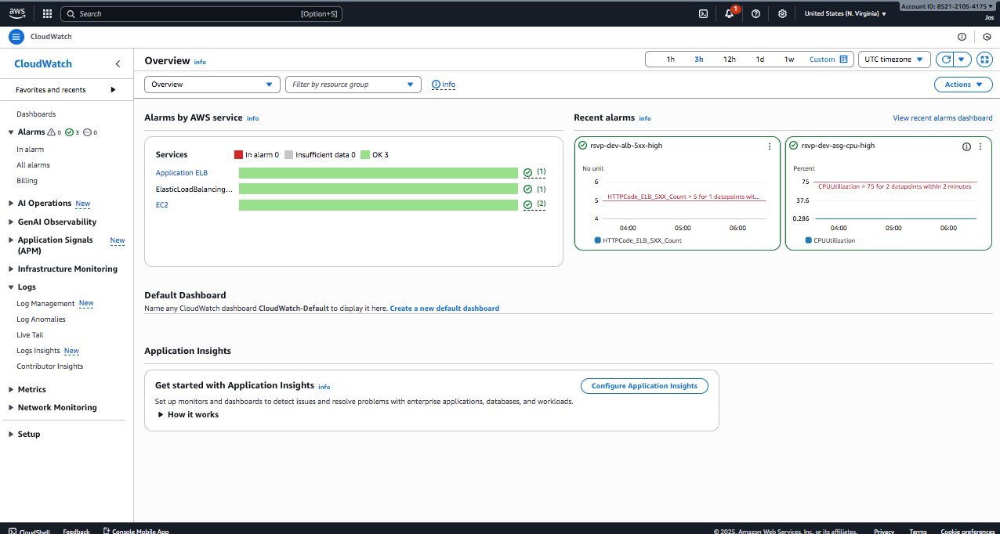
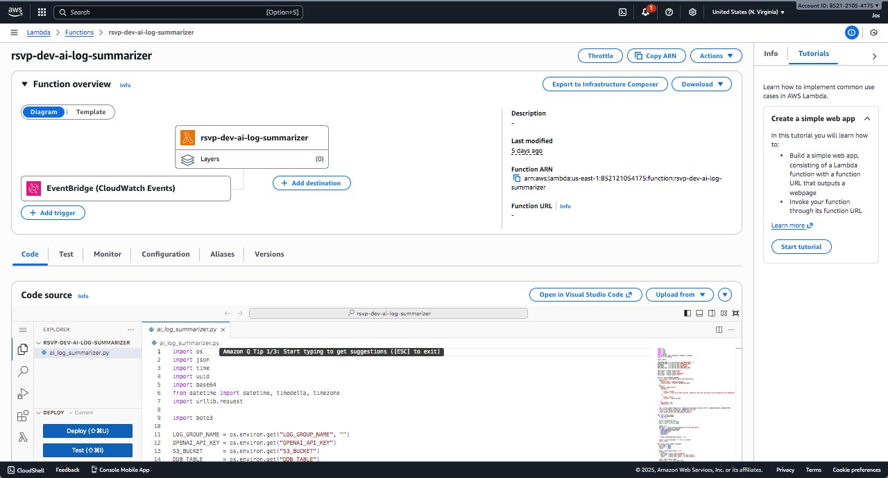
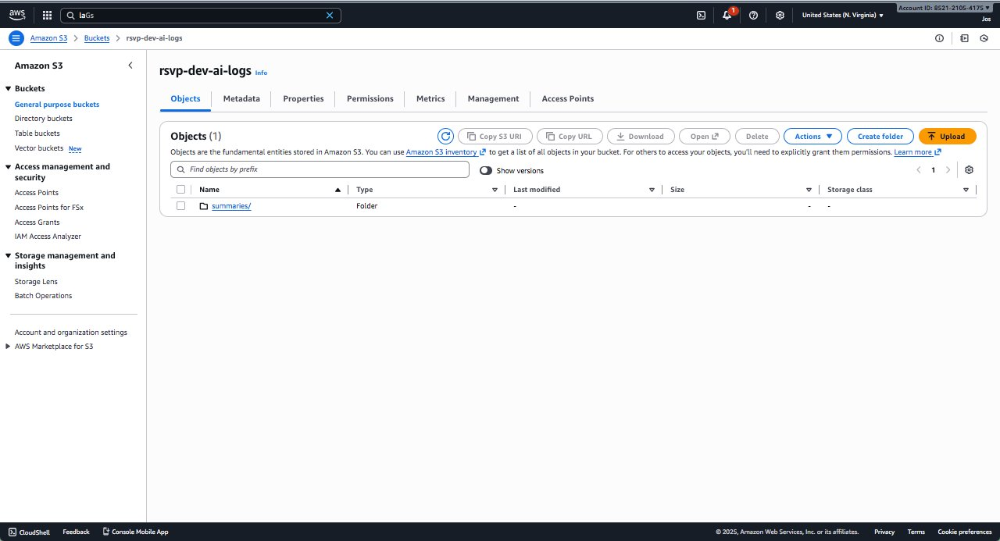
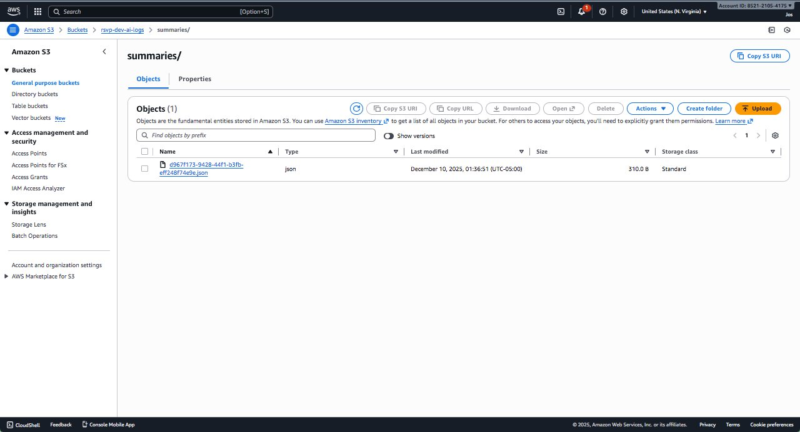
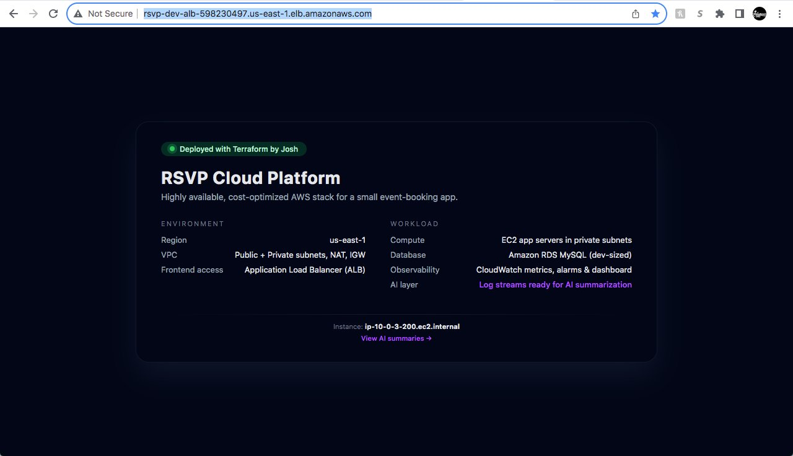

# Project 1 — RSVP Cloud Platform (Infrastructure Layer)

Project 1 provisions a production-style AWS web stack using Terraform: multi-AZ networking, ALB, EC2 Auto Scaling, RDS MySQL, and CloudWatch/SNS alerting. It also includes an alarm-driven log summarizer (EventBridge → Lambda) that writes summaries to S3/DynamoDB.

---

## Deployment

Status: Live 

Endpoints:
- App: http://rsvp-dev-alb-1273619337.us-east-1.elb.amazonaws.com/
- Health: http://rsvp-dev-alb-1273619337.us-east-1.elb.amazonaws.com/health

Evidence: see [`./evidence/`](./evidence/) for screenshots and Terraform outputs.

---

## Overview

Provisioned with Terraform:
- Networking: VPC across 2 AZs with public + private subnets, IGW/NAT, and routing
- Ingress: ALB in public subnets routing to private instances
- Compute: EC2 Auto Scaling Group (desired=2; health check: `/health`)
- Data: RDS MySQL in private subnets (no public access)
- Security: tiered security groups (ALB → app → DB)
- Operations:
  - CloudWatch alarms → SNS notifications
  - Alarm state change → EventBridge → Lambda → LLM summary → S3 + DynamoDB → SNS

## Architecture

## Business context
RSVP Society is an events/nightlife brand. The infrastructure needs to handle uneven traffic during promotions, support frequent updates, and make failures obvious quickly (alerts + actionable summaries).

## Architecture notes
- VPC: `10.0.0.0/16` across 2 AZs
- Public subnets: ALB + NAT egress
- Private subnets: EC2 app tier + RDS
- Security groups: ALB → app → DB (no public DB access)
- ALB: HTTP :80, health check `/health`
- ASG: min=2, desired=2, max=4 (t3.micro)
- RDS: db.t3.micro, private only, backups enabled
- Monitoring: CloudWatch alarms (ALB 5xx, ASG CPU) → SNS

## Alarm-driven log summaries
On CloudWatch alarm state changes, EventBridge invokes a Lambda that:
- pulls ~5 minutes of recent app logs from CloudWatch Logs (`/rsvp-dev/app`)
- generates a short incident summary
- stores the full record in S3 and metadata in DynamoDB
- publishes a brief notification to SNS

Notes:
- No auto-remediation; this is triage support only.
- If the model call fails, the Lambda still writes an error record to S3/DynamoDB.

---

## 📸 Infrastructure screenshots (evidence)

All screenshots and deployment artifacts are in the [`evidence/`](./evidence/) folder.

### VPC & Networking
  

### Load Balancing
  

### Compute

### Database

### Monitoring & AI Automation
  

### Storage (AI Log Summaries)
  

### Application UI

---

## Tech
Terraform · VPC · ALB · EC2 Auto Scaling · RDS MySQL · CloudWatch/SNS · EventBridge · Lambda · S3 · DynamoDB

## Status
Implemented:
- Multi-AZ VPC (public/private) with ALB → ASG and private RDS
- CloudWatch alarms → SNS notifications
- Alarm-driven log summaries (EventBridge → Lambda → S3/DynamoDB)

Planned:
- HTTPS on ALB (ACM) + basic WAF protections
- Secrets Manager for DB/LLM credentials
- Auto scaling policies + dashboards
- Multi-region DR (stretch)

---
