# Project 1 — RSVP Cloud Platform (Infrastructure Layer)

Project 1 builds the foundational AWS infrastructure for a small web application: networking, ingress, compute scaling, database, alerting, and an event-driven AI log summary workflow. This is a **production-style lab**: deployable, verifiable, and designed to be destroyed cleanly to control cost.

---

## Overview

This project provisions AWS infrastructure with **Terraform**:

- Multi-AZ VPC with public and private subnets
- Application Load Balancer (ALB)
- EC2 Auto Scaling Group for the web tier
- RDS MySQL in private subnets
- Internet Gateway + NAT Gateway + route tables
- Security groups scoped by tier (ALB → app → DB)
- CloudWatch alarms and log group (app logs)
- SNS alerts topic (email subscription optional)
- AI log summarization workflow:
  - **CloudWatch alarm actions → SNS email alerts**
  - **CloudWatch Alarm State Change → EventBridge → Lambda → OpenAI → S3 + DynamoDB → SNS**

This is a common baseline pattern for teams moving off a single server into AWS with predictable operations and a clear failure/alert path.

---

## Architecture diagram

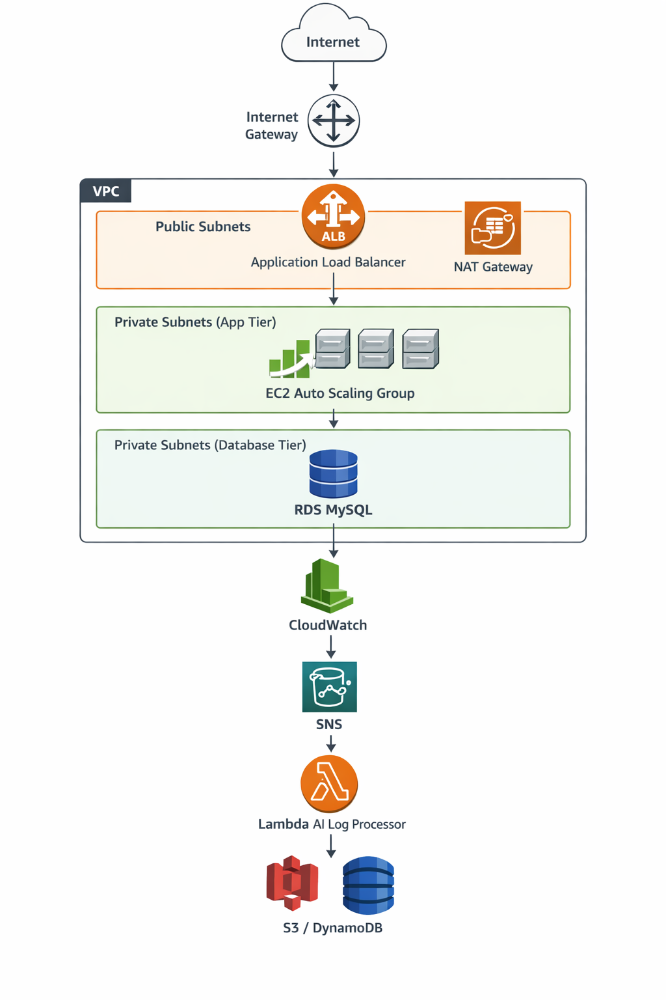

---

## Business problem

RSVP apps and event sites tend to spike during promos and major weekends. A single instance/VPS is a single point of failure. This project shows a baseline architecture that:

- scales the web tier horizontally
- keeps the database isolated in private subnets
- alerts on obvious failure signals (ALB 5xx, high CPU)
- produces a short, human-readable summary when an alarm fires

---

## Key design decisions

- **Multi-AZ VPC** to reduce single-AZ blast radius
- **ALB + Auto Scaling Group** instead of one EC2 instance
- **RDS MySQL in private subnets** for managed storage and isolation
- **Public subnets for ALB; private subnets for app/DB**
- **CloudWatch alarms + SNS** for alerts (no silent failures)
- **Event-driven AI summaries** only when alarms change state (no polling)

---

## Architecture breakdown

### Networking
- 1 VPC
- Public subnets (ALB, NAT)
- Private subnets (app tier, DB tier)
- Internet Gateway attached to the VPC
- NAT Gateway for private subnet egress (where needed)
- Separate route tables for public/private traffic flows

### Compute & load balancing
- ALB (HTTP listener; HTTPS is a planned enhancement)
- Target group routes to instances in an Auto Scaling Group
- ASG min/max/desired tuned for baseline cost control

### Database
- RDS MySQL instance
- Private subnets only
- DB security group allows inbound only from the app tier security group
- Automated backups handled by RDS

### Monitoring & alerts
- CloudWatch alarms (examples in this project):
  - ALB 5xx high
  - ASG average CPU high
- SNS topic for alerting (optional email subscription)

---

## AI log summarization (Implemented)

This project includes an event-driven summary workflow that turns an alarm + a short slice of recent logs into a stored JSON summary and a short notification.

### Trigger paths (two things happen)
1) **Alerting:** CloudWatch alarm actions publish to **SNS** (email subscription optional).  
2) **Summaries:** CloudWatch alarm state changes are matched by an **EventBridge rule**, which invokes the summarizer Lambda.

### Summary workflow
**CloudWatch Alarm State Change → EventBridge → Lambda → OpenAI → S3 + DynamoDB → SNS**

What the Lambda does:
- Pulls the last ~5 minutes of log lines from the app log group (`/${name_prefix}/app`)
- Calls OpenAI with the alarm details + recent logs
- Writes a full JSON record to S3: `summaries/<uuid>.json`
- Writes metadata to DynamoDB (id, timestamp, alarm, state, s3_key)
- Publishes a short message to SNS

### Guardrails (what this does and does not do)
- No auto-remediation. Output is summaries + suggestions only.
- Scoped context: alarm metadata + recent logs only.
- Fail-safe: if the model call fails, it records the error and still writes the record.
- Event-driven: runs on alarm state changes, not continuously.

---

## Verify (fast checks)

**Infrastructure**
- ALB target group shows **healthy** targets
- ASG instances are **InService**
- RDS status is **Available**
- CloudWatch alarms exist and are **OK** (or show expected state)

**AI summaries**
- Force or wait for an alarm state change (e.g., threshold breach)
- Confirm a new S3 object exists in `summaries/`
- Confirm a matching DynamoDB item exists with the same `id` / `s3_key`
- Confirm SNS has published the short message (email if subscribed)

---

## Cost strategy (practical)

Primary cost drivers in this stack:
- NAT Gateway hourly + data processing
- ALB hourly + LCUs
- EC2 instance-hours in the ASG
- RDS instance + storage + backups
- CloudWatch log ingestion + retention
- AI calls only occur on alarm state changes

Terraform makes it easy to spin the environment up for demos/tests and destroy it afterward.

---

## Future enhancements (not counted as delivered)
- HTTPS termination on ALB using ACM
- WAF rules for basic protections
- SSM Parameter Store / Secrets Manager integration
- Expand summaries to include trends (not just alarm events)
- Slack/Teams notifications

---

## 📸 Infrastructure screenshots (evidence)

### VPC & Networking
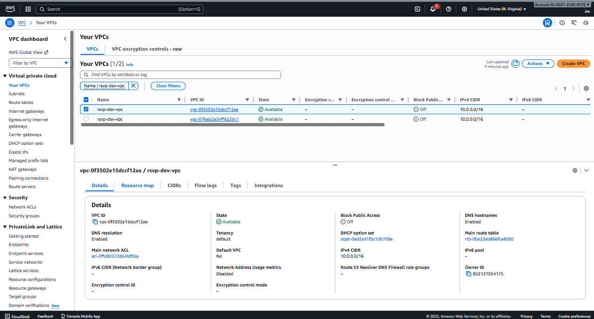  
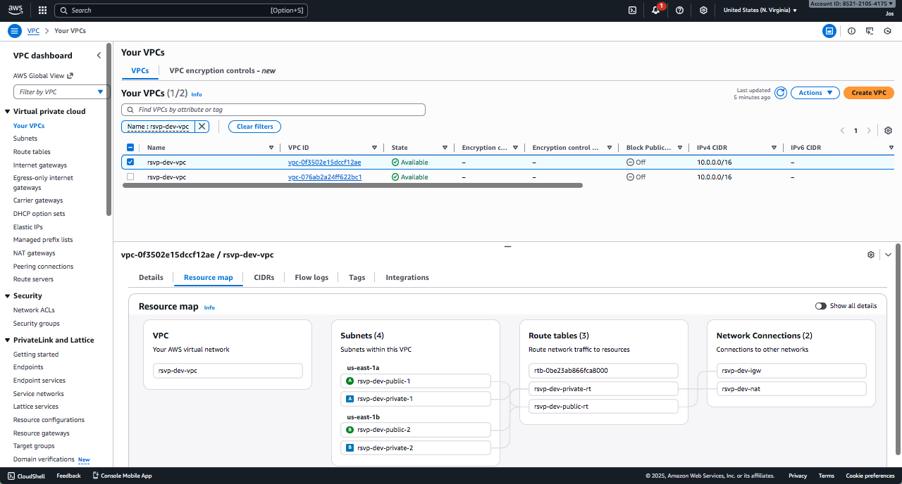  
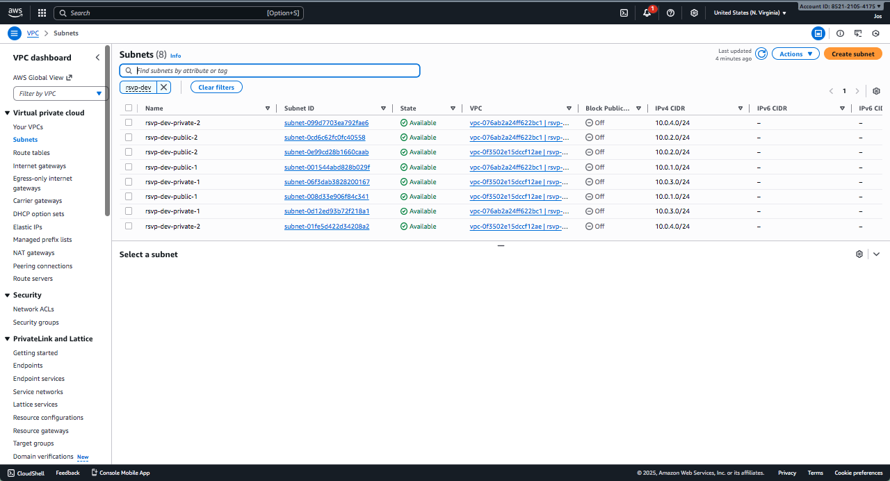

### Load Balancing
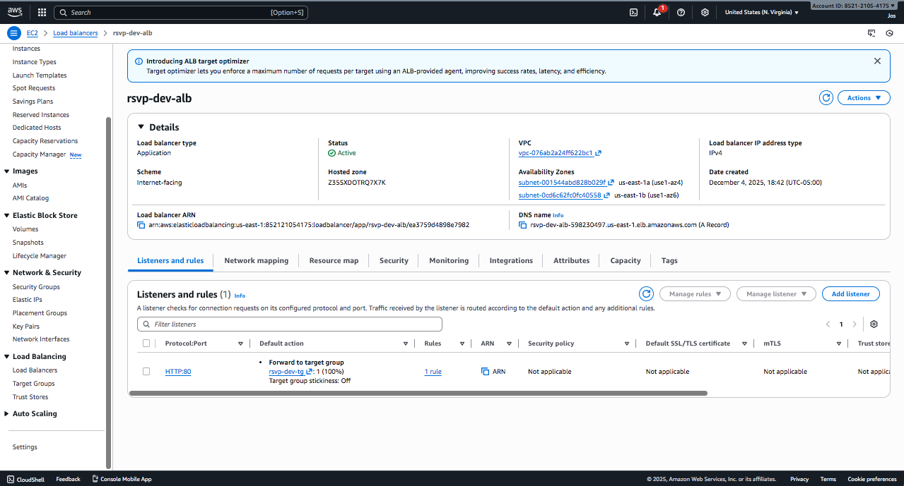  
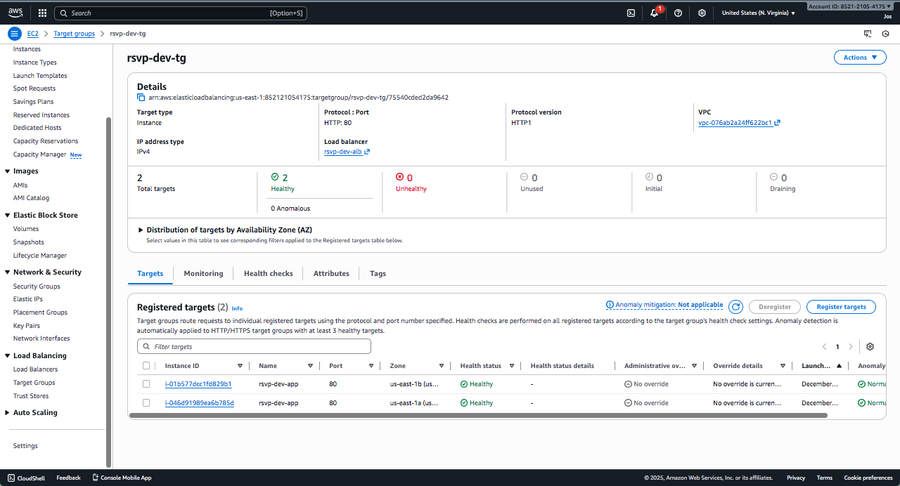

### Compute
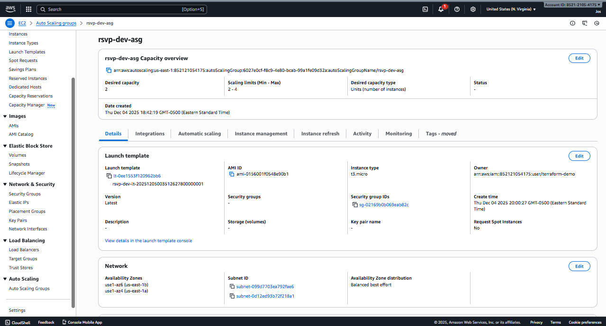

### Database
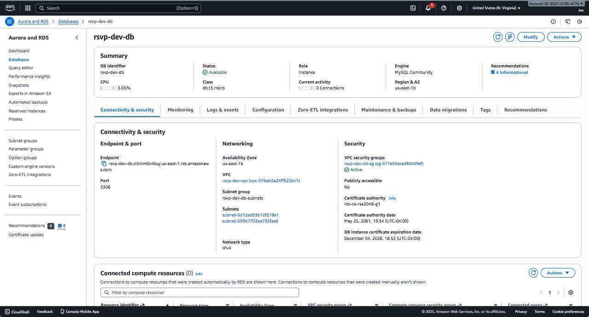

### Monitoring & AI Automation
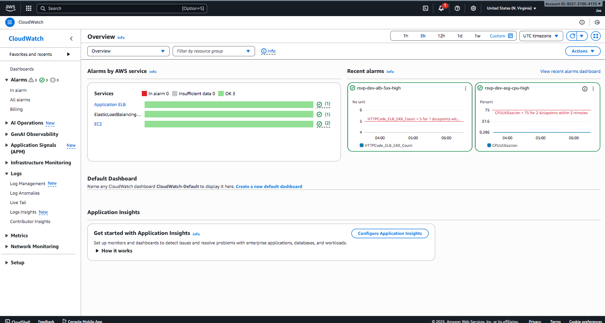  
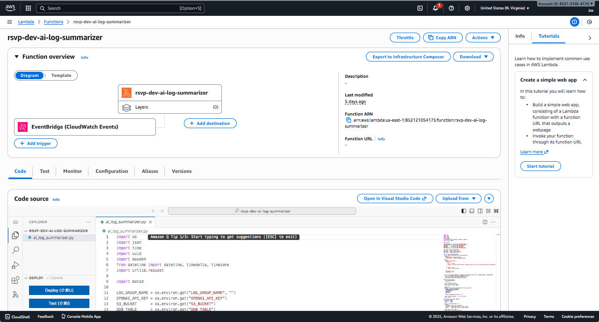

### Storage (AI Log Summaries)
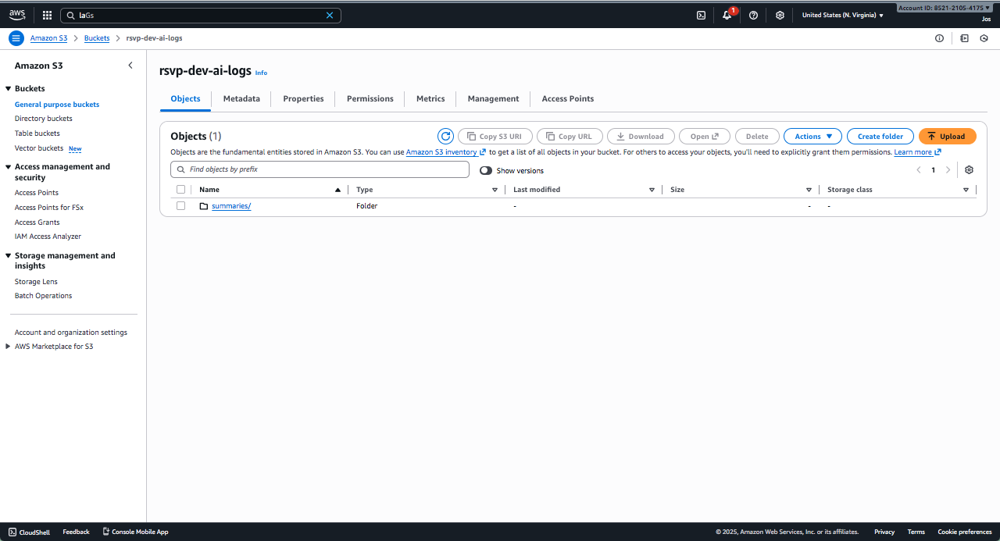  
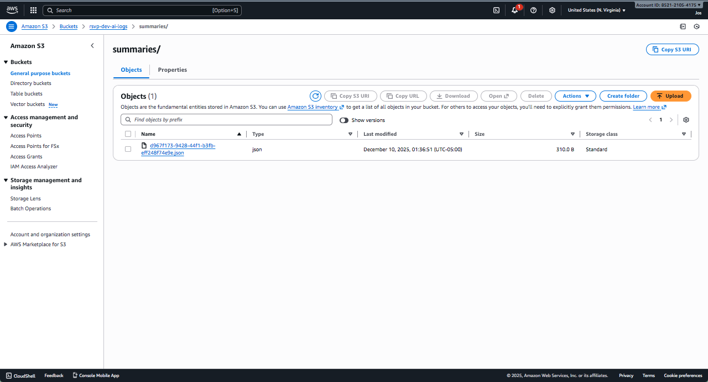

### Application UI
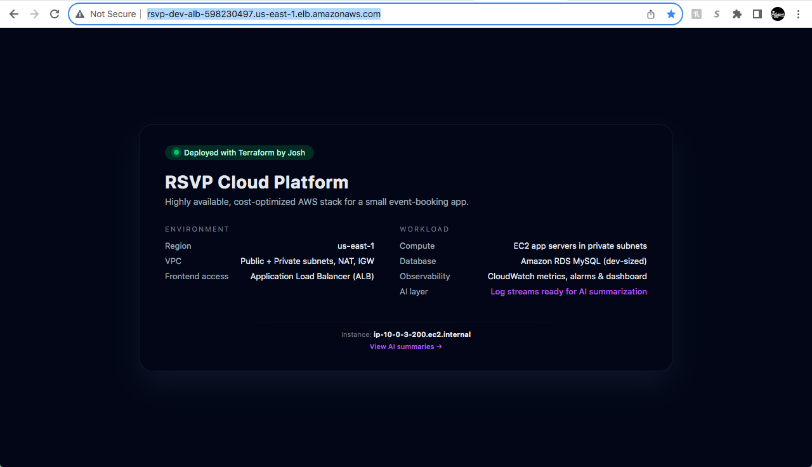

