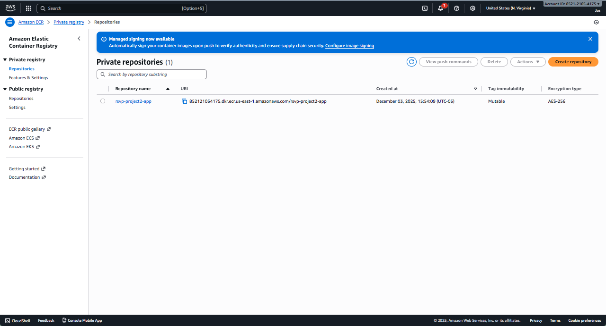
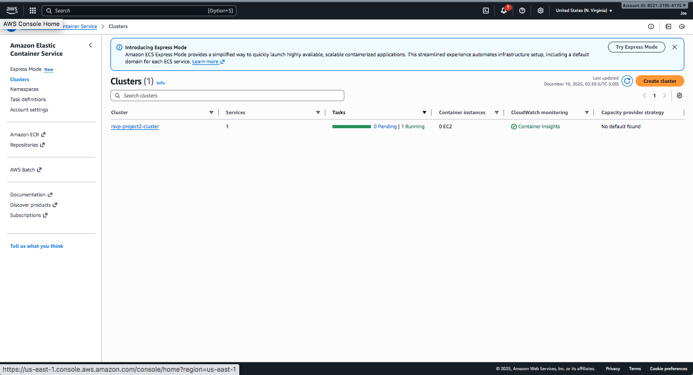
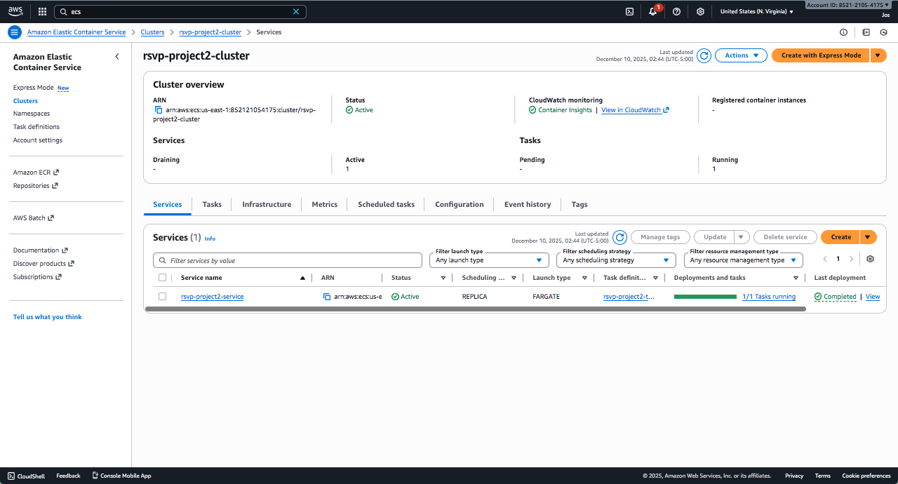
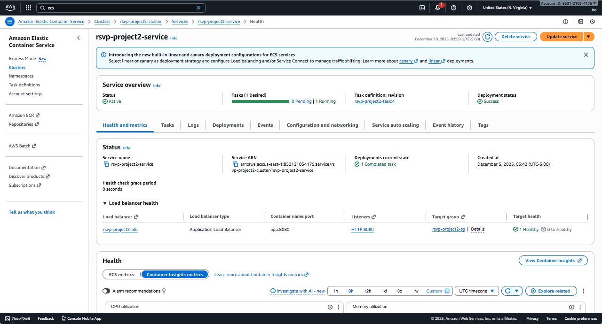
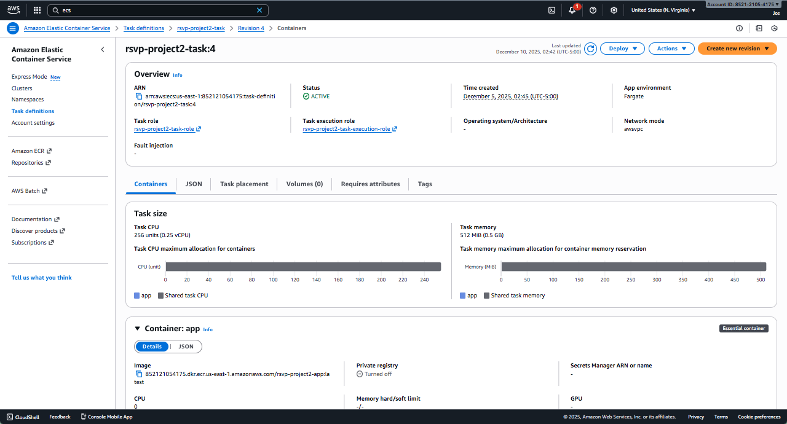
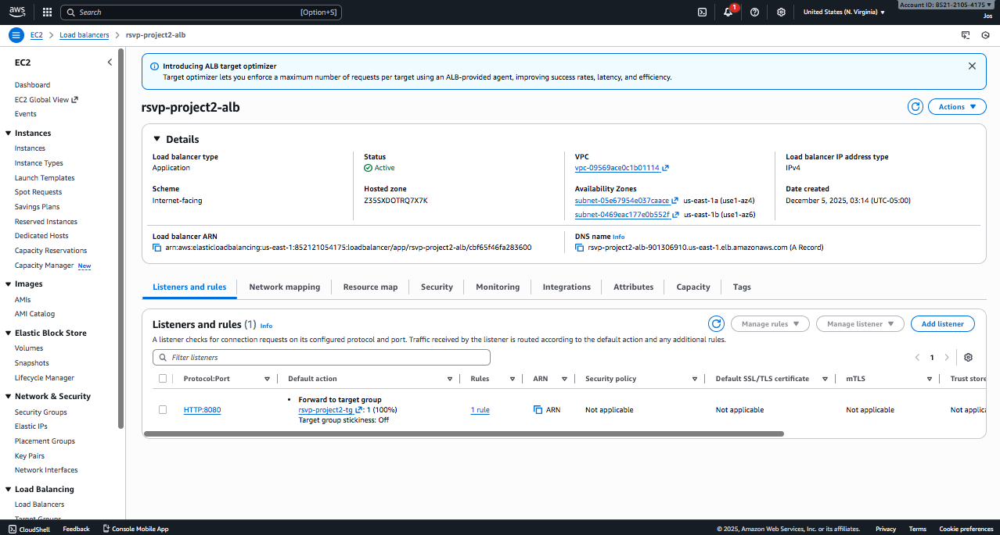
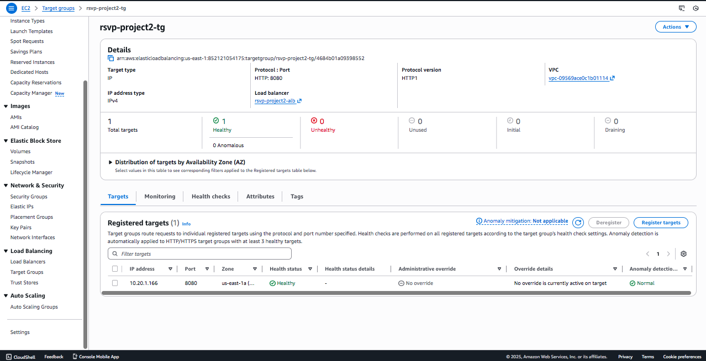
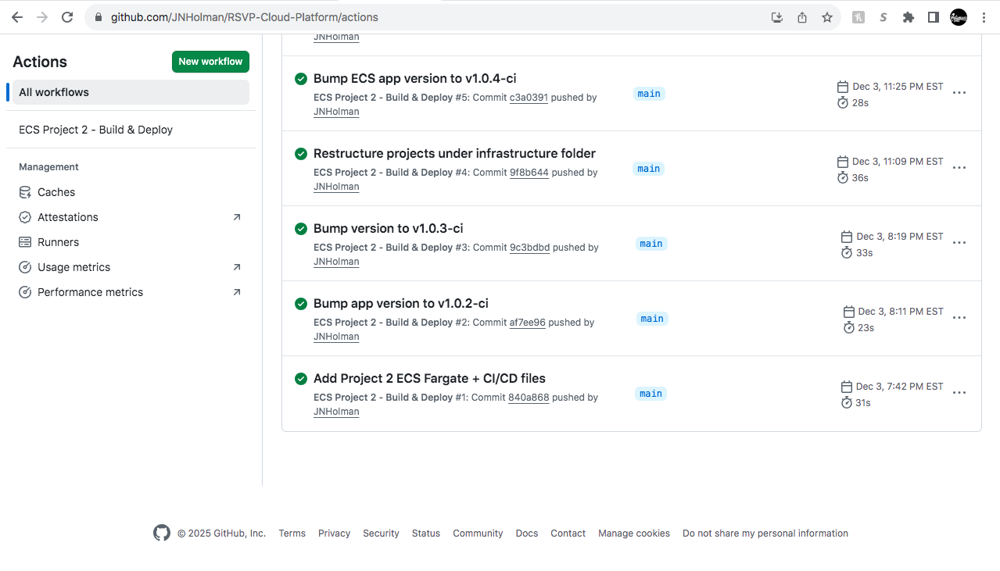
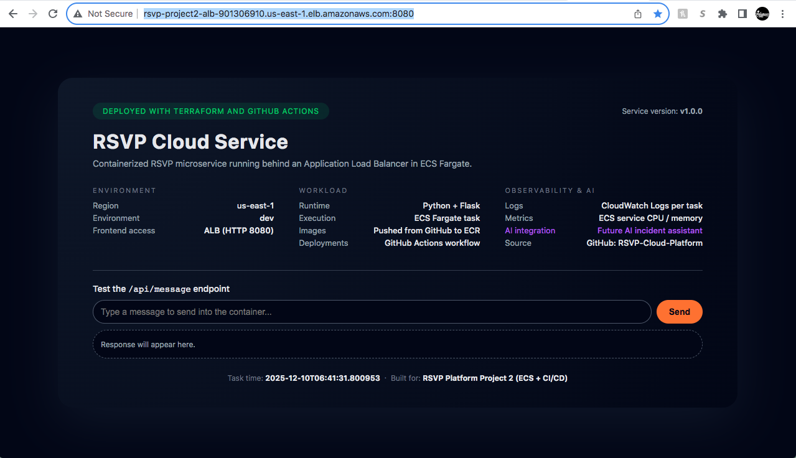

# Project 2 – Container Platform & CI/CD (Application Delivery Layer)

Project 2 modernizes the RSVP application from EC2-based deployments to **containers on ECS Fargate** with a fully automated **GitHub Actions CI/CD pipeline**.

---

## Overview

This project focuses on:

- Dockerizing the RSVP web application  
- Building and pushing images to Amazon ECR  
- Deploying the app to an ECS Fargate service behind a load balancer  
- Implementing a GitHub Actions pipeline to:  
  - Build  
  - Test  
  - Run basic security scans (as applicable)  
  - Push to ECR  
  - Update the ECS service  

The goal is to show how a Cloud Engineer can improve **developer velocity, reliability, and release safety**.

Live Service URL: [Project 2 Live Service](http://rsvp-project2-alb-901306910.us-east-1.elb.amazonaws.com:8080)

---

## Business Problem

RSVP Society needs to:

- Ship new features quickly (promo banners, event types, ticket changes)  
- Avoid downtime during deployments  
- Reduce “it works on my machine” issues  
- Standardize the runtime across environments  

Manual deployments to EC2 are slow, fragile, and inconsistent. Containers + CI/CD solve this by making deployments **repeatable and automated**.

---

## Architecture Decisions

Key choices:

- **Docker images** as the unit of deployment  
- **ECS Fargate** for serverless containers (no node management)  
- **Reuse or attach to a load balancer** so traffic routing stays consistent  
- **GitHub Actions** because the code already lives in GitHub  
- **Rolling deployments** to avoid downtime  

This provides a realistic path that many teams take when modernizing existing apps.
---

## Architecture Diagram

This diagram shows how the RSVP application is built, packaged, and deployed using containers and an automated CI/CD pipeline. Traffic is routed through a load balancer to ECS Fargate tasks, while GitHub Actions handles build, test, and deployment workflows.

---

## Architecture Breakdown

### Containerization

- Dockerfile for the RSVP web app  
- Local builds for dev/testing  
- Application packaged with its dependencies into a single image  

### Image Registry

- Amazon ECR repository for application images  
- Tagging strategy (e.g., `main`, `feature-*`, commit SHA)  

### ECS Fargate

- ECS cluster  
- Task definitions referencing the ECR image  
- Fargate service:
  - Desired count configured for high availability  
  - Integrated with a target group and load balancer  
  - Health checks to remove unhealthy tasks  

### CI/CD Pipeline (GitHub Actions)

Typical workflow stages:

1. **Trigger**  
   - On push to `main` or on pull request merge  

2. **Build & Test**  
   - Build Docker image  
   - Run unit tests (if configured)  

3. **Security Scan (optional/extendable)**  
   - Container scan or dependency check  

4. **Push to ECR**  
   - Authenticate to AWS  
   - Tag and push image  

5. **Deploy to ECS**  
   - Update service/task definition  
   - ECS performs rolling deployment behind the load balancer  

---

## Cost Strategy

- **Fargate** avoids managing EC2 worker nodes (saves ops time and removes always-on instance costs).
- **Right-sized task counts** limit how many containers run concurrently.
- Ability to **scale task count** up for promo events, down during normal periods.
- CI/CD pipeline uses **GitHub Actions minutes** plus minimal AWS cost during deploys.

This pattern is cost-efficient for small teams that want modern deployment workflows without building a complex Kubernetes platform.

---

## Business Outcomes

Moving to containers and CI/CD gives RSVP Society:

- Faster releases (new features can ship in minutes instead of days)
- Safer changes (pipeline adds checks before production)
- Less deployment stress (no manual SSH or package installs)
- Consistent environments from dev → prod

---

## Future Enhancements

Ideas to extend the platform:
- Add staging environment with approval gates before prod
- Integrate more advanced security scanning (Snyk, Trivy, etc.)
- Add blue/green or canary deployments for high-safety rollouts
- Introduce feature flags for gradual enablement
- Add performance tests into the pipeline for bigger releases
  
---

## 📸 Infrastructure Screenshots

Below are visual references showing the AWS resources deployed by this project.

### ECR – Container Image Repository

### ECS Cluster & Services

### Task Definition

### Load Balancing

### CI/CD Pipeline

### Application UI

