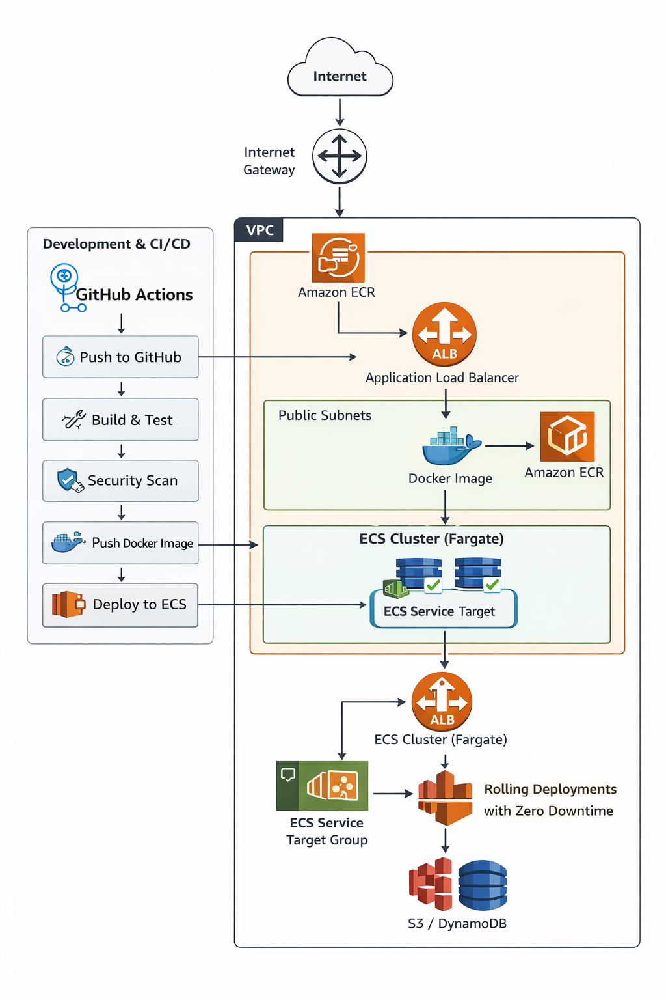
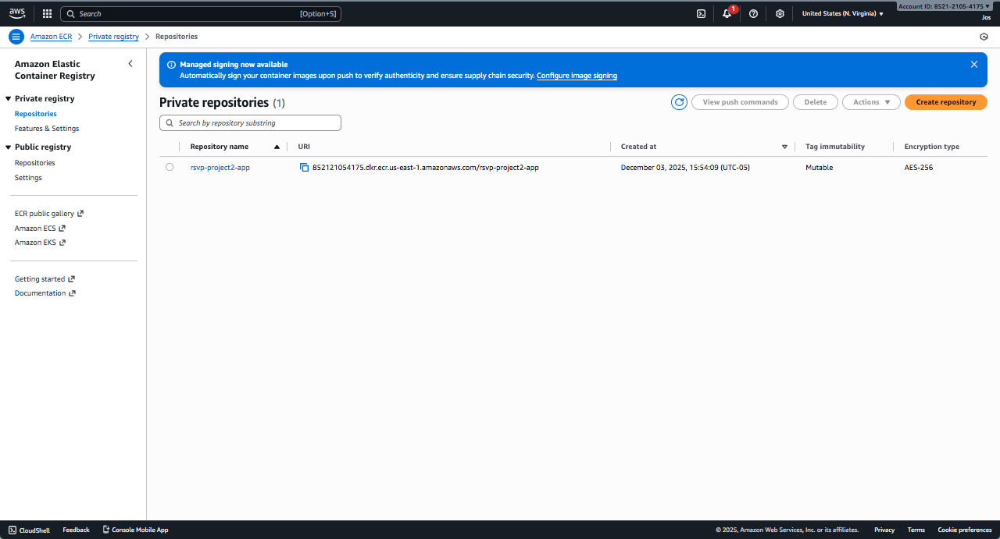
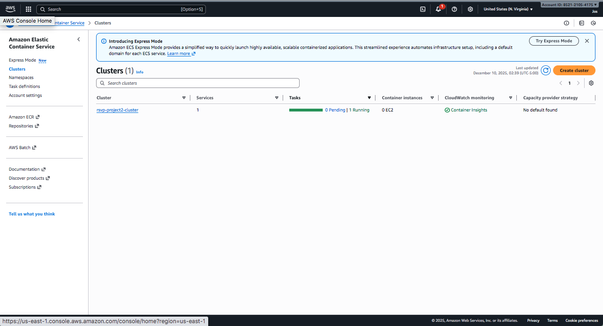
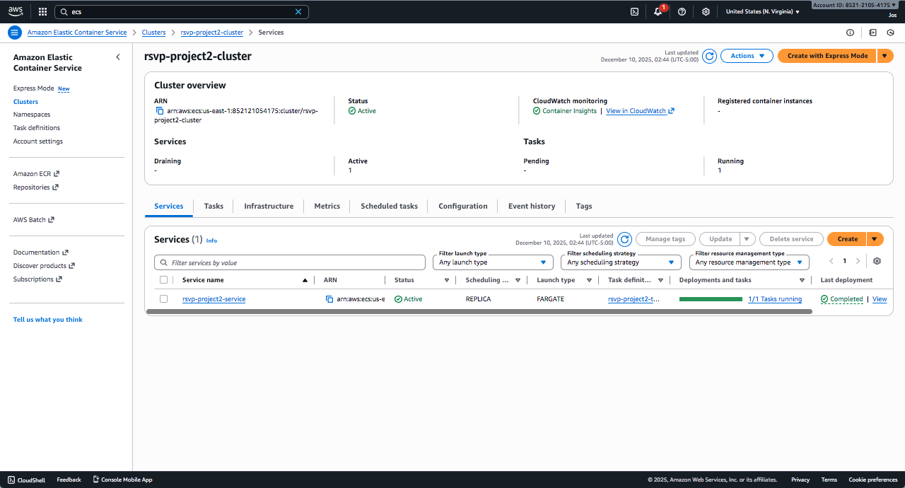
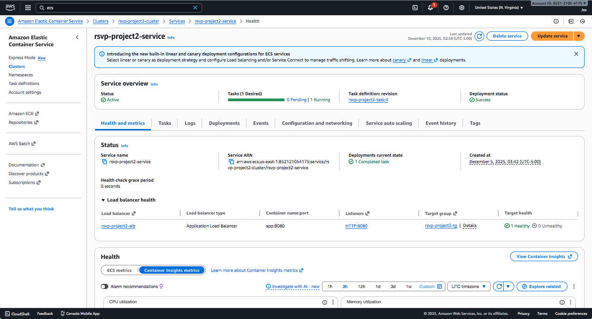
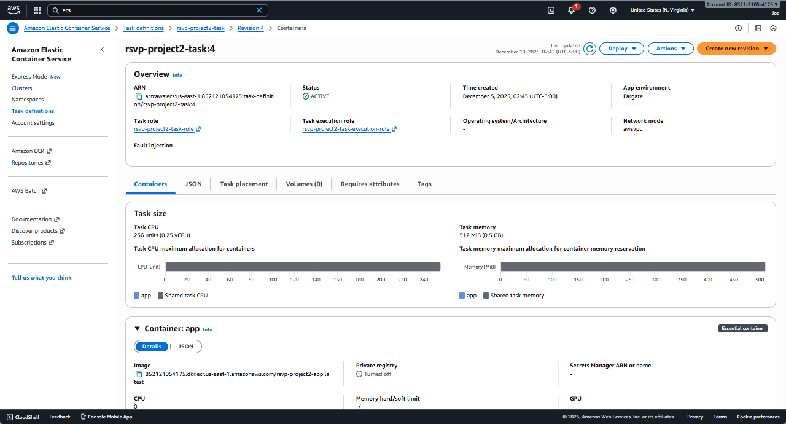
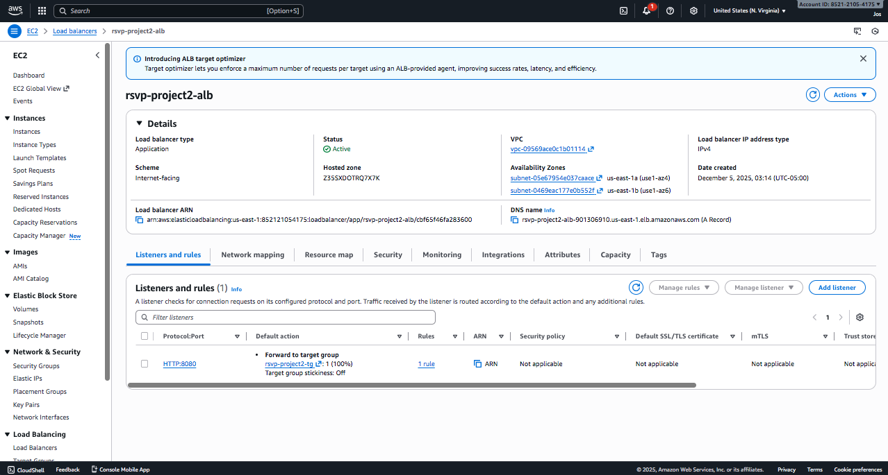
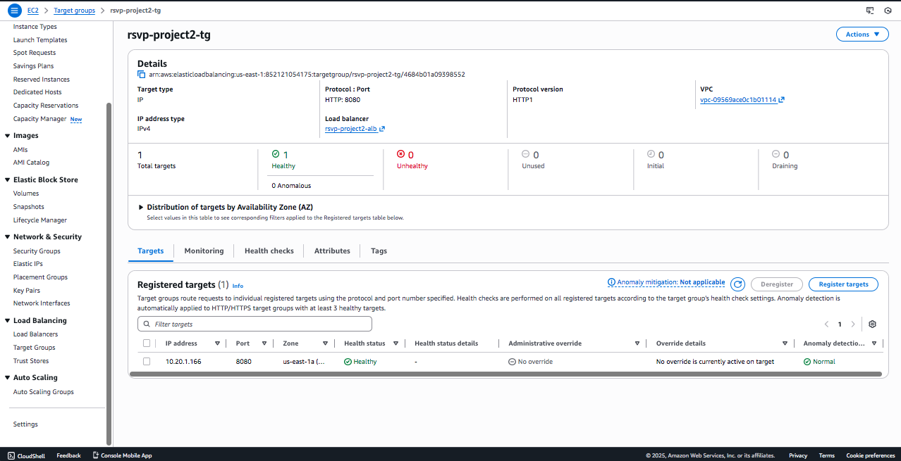

# Project 2 — Container Platform & CI/CD (Application Delivery Layer)

Project 2 moves the RSVP app from VM-style deployment to **containers on ECS Fargate**, with an automated **GitHub Actions** workflow that builds and publishes images to **ECR** and triggers an ECS redeploy.

---

## Live service

URL: http://rsvp-project2-alb-901306910.us-east-1.elb.amazonaws.com:8080

**Done when (user-facing):** The page loads and `/api/message` returns a response.

**Done when (AWS evidence):** ECS service has a running task and the ALB target group shows **Healthy** targets.

---

## Overview

This project includes:

- Dockerized RSVP web application
- Amazon ECR repository for container images
- ECS Fargate cluster/service behind an Application Load Balancer
- GitHub Actions workflow that:
  - builds the Docker image
  - tags and pushes to ECR (`$GITHUB_SHA` and `latest`)
  - triggers a rolling redeploy of the ECS service

This repo shows a practical “small team” delivery path: standard runtime, repeatable builds, and automated deployments without standing up Kubernetes.

---

## Business problem

RSVP Society needs to ship updates quickly without manual SSH deploys and “works on my machine” issues. Containers + ECS provide a consistent runtime, and GitHub Actions automates the release steps.

---

## Architecture diagram

---

## Architecture breakdown

### Containerization
- App packaged as a Docker image
- Local build supported for dev/testing

### Image registry (ECR)
- ECR stores images for deployment
- Tags used:
  - `latest`
  - commit SHA (`$GITHUB_SHA`) for traceability

### ECS Fargate
- ECS cluster runs the service on Fargate (no instance management)
- Service is attached to an ALB target group
- Health checks remove unhealthy tasks

### CI/CD (GitHub Actions)
Workflow file: `.github/workflows/ecs-project2-deploy.yml`

What it does today:
1. Triggers on pushes to `main` affecting `infrastructure/project-2-ecs-cicd/`
2. Builds the Docker image
3. Logs into ECR and pushes:
   - `:latest`
   - `:${GITHUB_SHA}`
4. Forces an ECS service redeploy

**Note:** the current workflow triggers a redeploy; it does not register a new task definition revision pinned to the SHA image. That is listed under Future Enhancements.

---

## Verify (fast checks)

- **ECR:** Repository contains `latest` and a recent SHA tag
- **ECS service:** Desired task count is running
- **Target group:** Targets are **healthy**
- **ALB:** Live URL returns HTTP 200 and renders the UI
- **Deployment traceability:** The image tag exists in ECR for the commit you pushed

---

## Cost notes (high-level)

Primary costs come from:
- ALB hourly + LCUs
- Fargate CPU/memory-hours
- CloudWatch logs

This setup is designed to be simple to operate and easy to tear down when not needed.

---

## Future enhancements (not counted as delivered)

- Pin deployments to immutable releases by registering a new task definition revision using the SHA image tag
- Add basic unit tests in the GitHub Actions workflow
- Add a container scan step (Trivy/Grype/Snyk)
- Add a staging environment with approval gates
- Add blue/green or canary deployment strategy (if needed)

---

## 📸 Infrastructure screenshots

### ECR — Container Image Repository

### ECS Cluster & Services

### Task Definition

### Load Balancing

## Latest Update
- Implemented SHA-pinned immutable deployments
- Production-grade CI/CD pipeline

