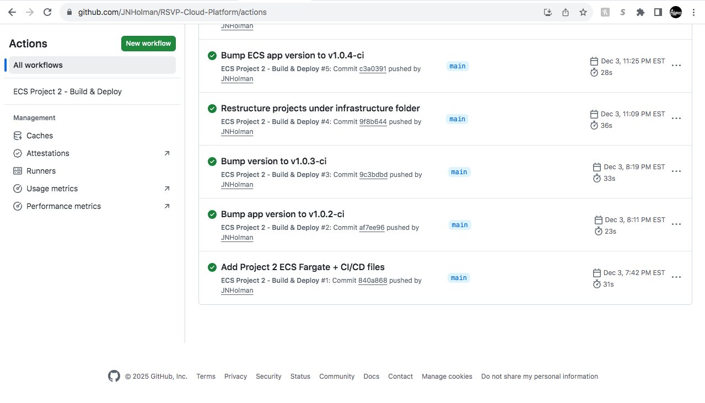
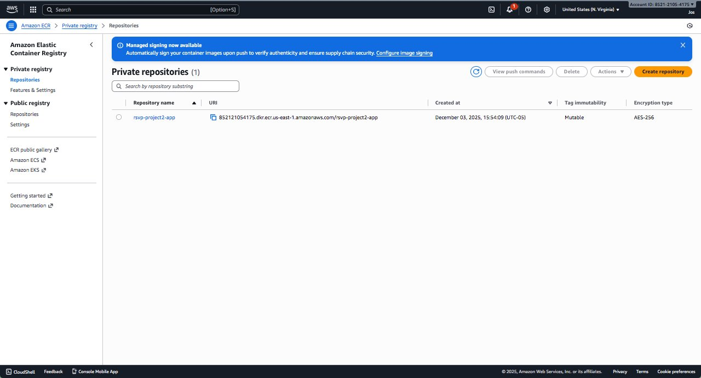
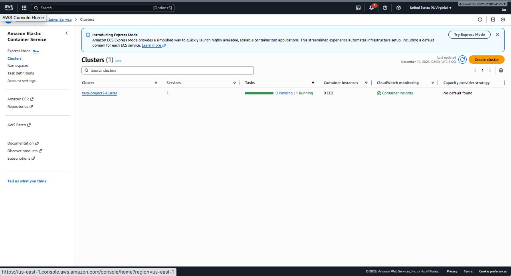
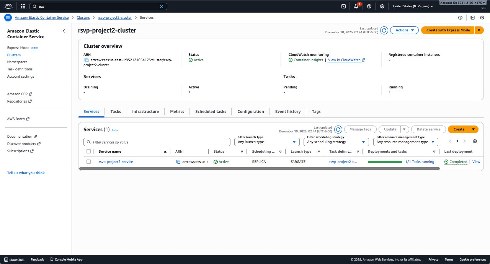
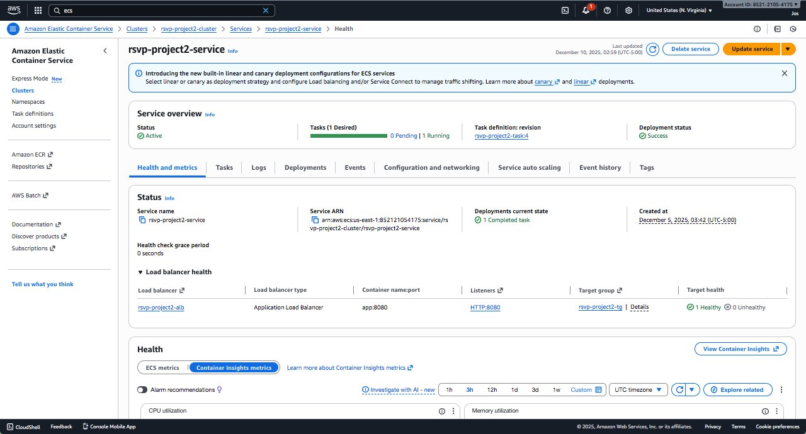
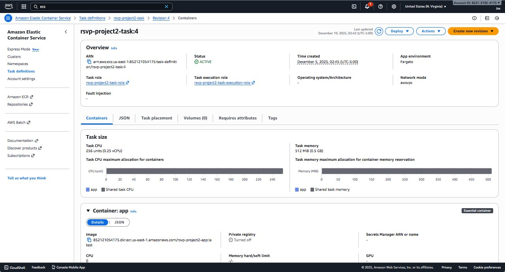
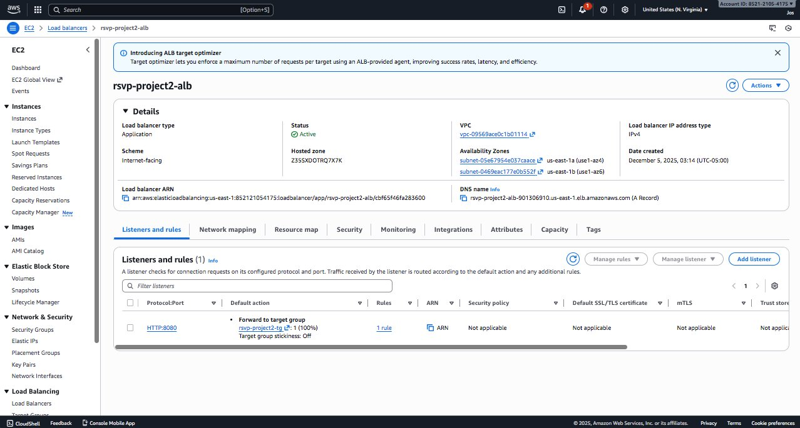
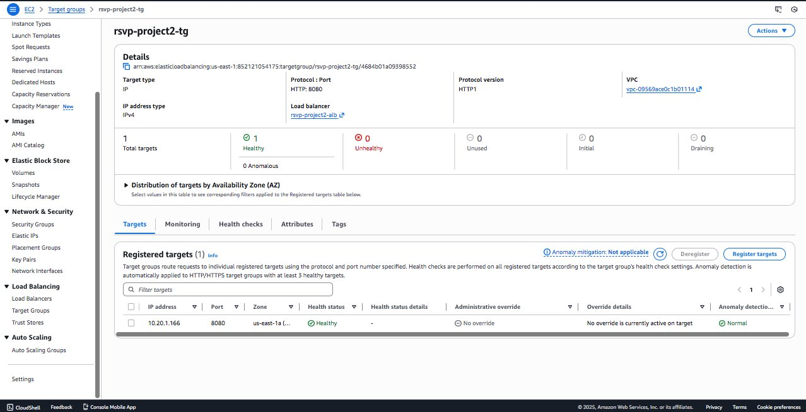
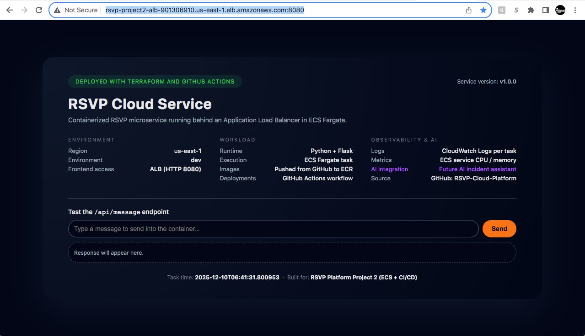

# Project 2 — Container Platform & CI/CD (Application Delivery Layer)

Project 2 moves the RSVP app from VM-style deployment to containers on ECS Fargate, with an automated GitHub Actions workflow that builds SHA-tagged immutable images, pushes to ECR, and deploys via blue/green ECS service updates.

---

## 🚀 Live Service

**URL:** http://rsvp-project2-alb-901306910.us-east-1.elb.amazonaws.com:8080  
**Current Version:** SHA-pinned immutable deployment  
**Status:** ✅ Active and healthy

**Done when (user-facing):** The page loads and `/api/message` returns a response.  
**Done when (AWS evidence):** ECS service has a running task and the ALB target group shows Healthy targets.

---

## Overview

This project includes:

* **Dockerized RSVP web application** (Python + Flask)
* **Amazon ECR repository** for container images with SHA-based tagging
* **ECS Fargate cluster/service** behind an Application Load Balancer
* **Production-grade GitHub Actions workflow** that:
  * Builds the Docker image
  * Tags with Git commit SHA (immutable, auditable)
  * Pushes to ECR
  * Creates new ECS task definition with SHA-tagged image
  * Updates ECS service for blue/green deployment
  * Waits for service stabilization

This repo demonstrates a practical "small team" delivery path: standard runtime, repeatable builds, immutable deployments, and automated releases without managing Kubernetes.

---

## Business Problem

RSVP Society needs to ship updates quickly without manual SSH deploys and "works on my machine" issues. Containers + ECS provide a consistent runtime, and GitHub Actions automates the release steps with full traceability via Git SHAs.

---

## Architecture Breakdown

### Containerization
- App packaged as a Docker image
- Multi-stage build for optimization
- Local build supported for dev/testing

### Image Registry (ECR)
- ECR stores images with SHA-based tags
- Each commit gets unique, immutable image tag
- Example: `852121054175.dkr.ecr.us-east-1.amazonaws.com/rsvp-project2-app:9ff0fa4`
- Enables exact version tracking and rollbacks

### ECS Fargate
- ECS cluster runs service on Fargate (no EC2 instance management)
- Task definition: 256 CPU units (0.25 vCPU), 512 MiB memory
- Service attached to ALB target group
- Health checks automatically remove unhealthy tasks
- Blue/green deployment strategy

### Load Balancing
- Application Load Balancer (internet-facing)
- HTTP listener on port 8080
- Target group with health checks
- Distributes traffic across healthy ECS tasks

### CI/CD (GitHub Actions)

**Workflow file:** `.github/workflows/ecs-project2-deploy.yml`

**Production-grade pipeline:**

1. **Trigger:** Pushes to `main` affecting `infrastructure/project-2-ecs-cicd/`
2. **Build:** Docker image with Git SHA tag
3. **Push:** Image to ECR with immutable SHA tag
4. **Download:** Current ECS task definition
5. **Update:** Task definition JSON with new image SHA
6. **Register:** New task definition revision
7. **Deploy:** Update ECS service with new task definition
8. **Verify:** Wait for service to stabilize (blue/green complete)

**Key improvements over basic workflows:**
- ✅ Immutable SHA-tagged images (no mutable `latest` tag)
- ✅ New task definition created for each deploy
- ✅ Proper blue/green deployment (not `--force-new-deployment`)
- ✅ Deployment verification (waits for service stability)
- ✅ Full audit trail (Git SHA = exact code version)
- ✅ Rollback capability (deploy any previous SHA)

---

## Verify (Fast Checks)

**Infrastructure:**
- ✅ ECR: Repository contains SHA-tagged images
- ✅ ECS Cluster: 1 service active, 1 task running
- ✅ ECS Service: Desired count matches running count
- ✅ Task Definition: References SHA-tagged image
- ✅ Target Group: Targets are healthy
- ✅ ALB: Live URL returns HTTP 200 with rendered UI

**Deployment Traceability:**
- ✅ Image tag in ECR matches Git commit SHA
- ✅ Task definition revision tracks each deployment
- ✅ GitHub Actions logs show exact image deployed

---

## Cost Notes

**Estimated monthly cost:** ~$60-70 (us-east-1, single task)

Primary costs:
- **Fargate:** ~$10/month (0.25 vCPU, 512 MB, 24/7)
- **ALB:** ~$16/month (hourly + LCUs)
- **NAT Gateway:** ~$32/month (required for ECR access)
- **ECR Storage:** ~$1/month
- **CloudWatch Logs:** ~$2/month

**Cost optimization:**
- Single task deployment (minimal for demo)
- Can stop service when not in use
- Smaller Fargate sizing
- Clean up old ECR images periodically

---

## Deployment History

**Recent deployments:**
- **Latest:** SHA-pinned deployment with new CI/CD workflow
- **v1.0.4-ci:** Previous mutable-tag deployment
- **v1.0.3-ci:** Earlier version
- **v1.0.2-ci:** Initial automated deployment

All deployments tracked via GitHub Actions with full logs.

---

## What This Demonstrates

**Modern Container Delivery:**
- Microservices architecture pattern
- Serverless compute (Fargate - no EC2 management)
- Immutable infrastructure (SHA-tagged images)
- Automated deployments with verification

**DevOps Best Practices:**
- Infrastructure as Code (Terraform)
- CI/CD automation (GitHub Actions)
- SHA-based versioning (audit trail)
- Blue/green deployments (zero-downtime)
- Health check monitoring (automatic recovery)

**Production Readiness:**
- Load balancer redundancy
- Container isolation
- Automated rollouts
- Health-based routing
- Rollback capability

---

## 📸 Infrastructure Screenshots

### CI/CD Pipeline
  
*Successful automated deployments with build, push, and deploy steps*

### Container Registry
  
*Amazon ECR with SHA-tagged container images*

### ECS Infrastructure
  
*ECS Fargate cluster with active service*

  
*Service configuration and deployment status*

  
*Service health metrics and target status*

### Task Configuration
  
*Task definition with CPU, memory, and container settings*

### Load Balancing
  
*Application Load Balancer configuration*

  
*Target group with healthy ECS tasks*

### Application
  
*Live containerized application interface*

---

## Future Enhancements (Planned)

- [ ] HTTPS with ACM certificate and custom domain
- [ ] Container image scanning (Trivy/Grype) in CI/CD
- [ ] Unit tests in GitHub Actions workflow
- [ ] Staging environment with approval gates
- [ ] Auto-scaling policies based on CPU/memory
- [ ] CloudWatch Container Insights dashboard
- [ ] Canary deployment strategy (if needed)

---

## Technical Stack

- **Container Runtime:** Docker
- **Orchestration:** AWS ECS Fargate
- **Registry:** Amazon ECR
- **Load Balancing:** AWS Application Load Balancer
- **CI/CD:** GitHub Actions
- **Infrastructure:** Terraform
- **Application:** Python + Flask
- **Networking:** AWS VPC with public/private subnets

---

**Author:** Josh Holman  
**Last Updated:** February 2, 2026  
**Region:** us-east-1
