# Project 3 – Security Governance & AI Incident Response Lab

Project 3 builds a single-account security and governance layer with working AWS security services, AI-powered incident analysis, and a portfolio dashboard. It models multi-account concepts (Organizations, SCPs, Identity Center) via documentation and naming conventions while deploying real security tooling in a single AWS account.

---

## Deployment

**Status:** Portfolio (torn down)

Evidence: see [`./evidence/`](./evidence/) for screenshots, deployment outputs, and sample AI analysis results.

---

## Overview

This project uses **Terraform** to deploy:

**Working security infrastructure:**
- GuardDuty threat detection (enabled)
- Security Hub (findings aggregation)
- AWS Config with 3 managed rules (S3 public access, root MFA, IAM key rotation)
- CloudTrail logging to a central S3 bucket
- SNS alerting for security findings

**AI-powered analysis (two Lambda functions):**
- **Incident Lambda:** Ingests GuardDuty findings via EventBridge, sends context to an LLM, stores human-readable summaries (impact, risk level, next steps) in DynamoDB
- **Cost Lambda:** Runs on a weekly EventBridge schedule, pulls Cost Explorer data, generates AI-written cost analysis, stores in DynamoDB. Falls back to sample data if Cost Explorer is not enabled in the account.

**Dashboard API + static UI:**
- API Gateway + Lambda serving incident and cost data from DynamoDB
- Static React dashboard hosted on S3 (currently renders sample data for portfolio display)

**Modeled (not deployed):**
- AWS Organizations structure (represented as a CloudFormation metadata stack for documentation purposes)
- Multi-account separation, SCPs, IAM Identity Center, Budgets, and Cost Anomaly Detection are described as architecture goals but are not provisioned as Terraform resources

---

## Business Problem

As any platform grows, teams face questions about environment separation, consistent security posture, cost visibility, and fast incident response. Project 3 demonstrates the building blocks a Cloud Engineer would use to answer those questions — with working security services and AI analysis in a lab setting, and a documented path to full multi-account governance.

---

## Architecture

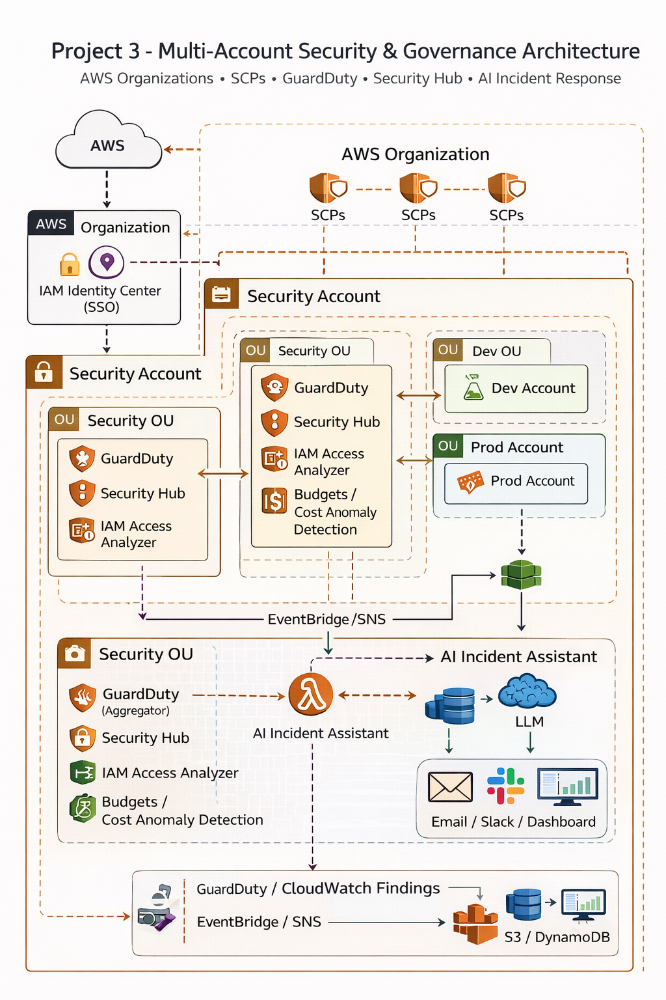

### What's deployed (single-account lab)

| Layer | Resources | Status |
|-------|-----------|--------|
| Security services | GuardDuty, Security Hub, AWS Config (3 rules) | Provisioned |
| Logging | CloudTrail → S3 bucket (versioned, lifecycle) | Provisioned |
| AI incident response | EventBridge → Lambda → OpenAI → DynamoDB + SNS | Provisioned |
| AI cost analysis | EventBridge (weekly) → Lambda → Cost Explorer → DynamoDB | Provisioned (falls back to sample data if CE unavailable) |
| Dashboard API | API Gateway v2 → Lambda → DynamoDB | Provisioned |
| Dashboard UI | S3 static website (React) | Deployed with sample data |
| Alerting | SNS topic + email subscription | Provisioned |

### What's modeled (documented, not provisioned)

| Concept | How it's represented |
|---------|---------------------|
| AWS Organizations | CloudFormation metadata-only stack (`org/org.tf`) |
| Multiple accounts (Security/Dev/Prod) | Terraform provider aliases all pointing to the same account |
| SCPs | Described in architecture docs; no `aws_organizations_policy` resources |
| IAM Identity Center | Described as a design goal; no SSO resources |
| Budgets / Cost Anomaly Detection | Described as a design goal; no budget resources |

The distinction matters: the security services and AI analysis are real working infrastructure. The organizational structure is a design blueprint showing how these components would be arranged across accounts at scale.

---

## AI Incident Assistant

1. GuardDuty detects a finding (e.g., unusual API calls, exposed credentials)
2. EventBridge routes the finding to the incident Lambda
3. Lambda collects context and sends it to an LLM (OpenAI)
4. The LLM returns an incident summary: what triggered it, likely impact, risk level, recommended next steps
5. Summary is stored in DynamoDB and a notification is sent via SNS

This turns streams of raw JSON findings into actionable, human-readable analysis.

## AI Cost Analysis

1. EventBridge fires on a weekly schedule
2. Lambda calls AWS Cost Explorer for spend data
3. LLM analyzes spending patterns and generates a written summary
4. Summary is stored in DynamoDB

**Note:** If Cost Explorer is not enabled or returns an error, the Lambda falls back to realistic sample data and continues. The evidence screenshots may reflect sample-data output rather than live Cost Explorer queries.

---

## Dashboard

The dashboard is a React single-page app hosted on S3. It currently renders **hardcoded sample data** for portfolio demonstration purposes. The API Gateway + Lambda backend is wired to DynamoDB and would serve real data when the AI Lambdas have processed findings.

---

## Cost Strategy

- Security services (GuardDuty, Security Hub, Config) are lightweight and low-cost
- AI analysis runs only on events/findings and a weekly schedule, not continuous streams
- Lambda + API Gateway pricing is effectively free at portfolio-demo volume
- DynamoDB on-demand keeps storage costs proportional to actual findings

---

## 📸 Screenshots

### AWS Organizations
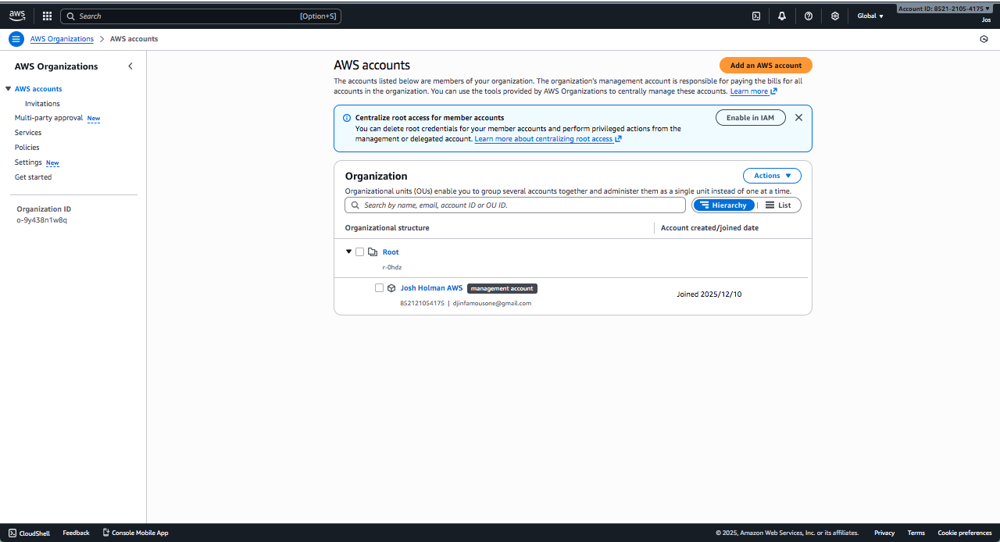

### IAM Governance
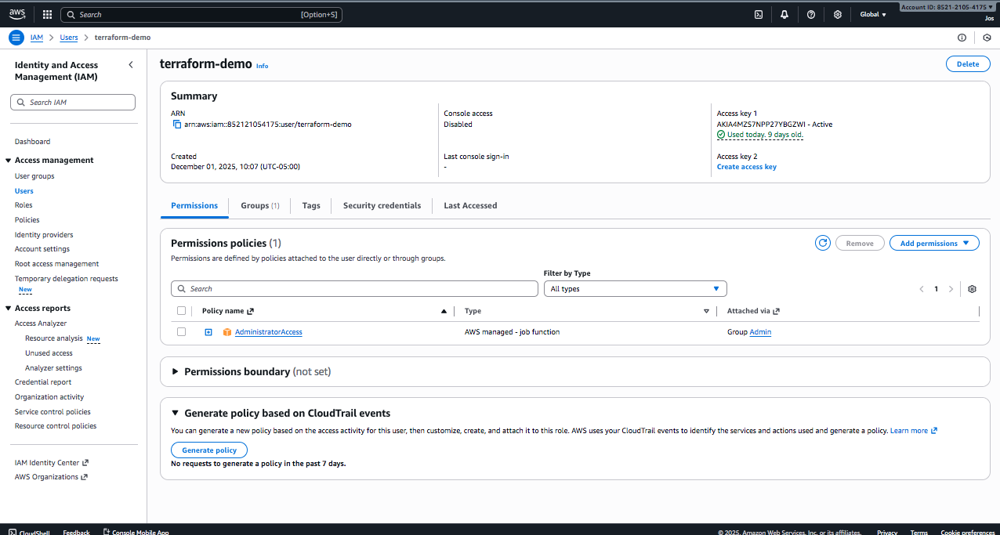
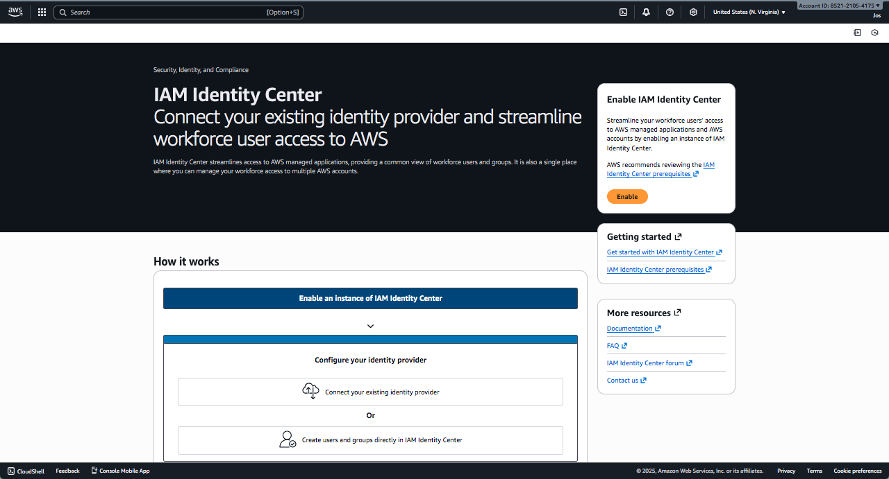
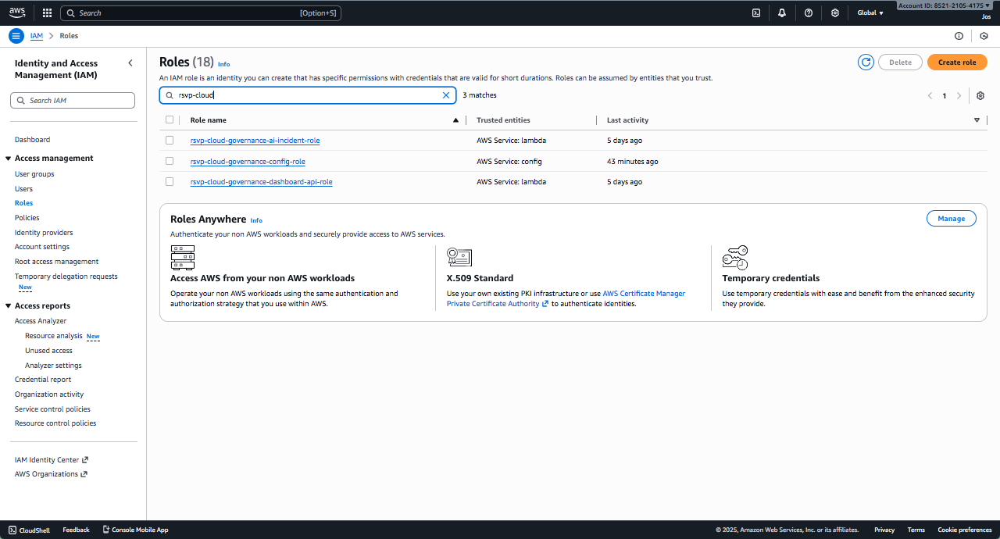
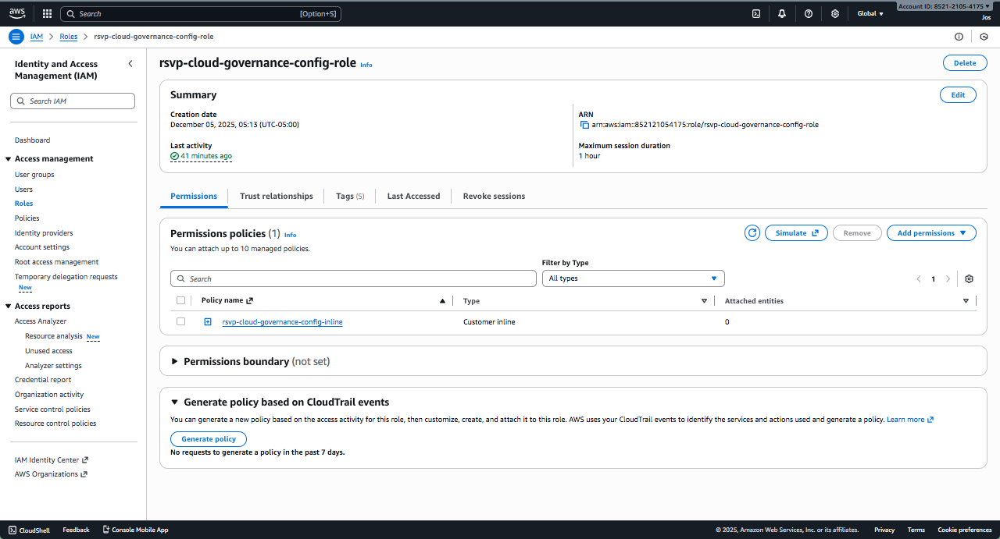
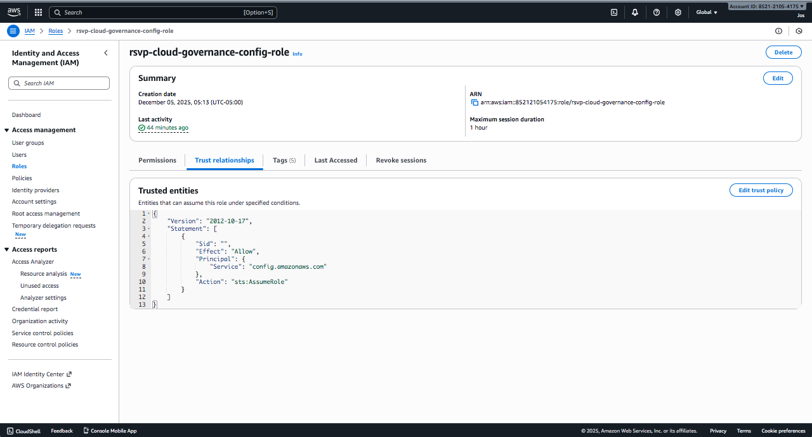

### Security & Compliance
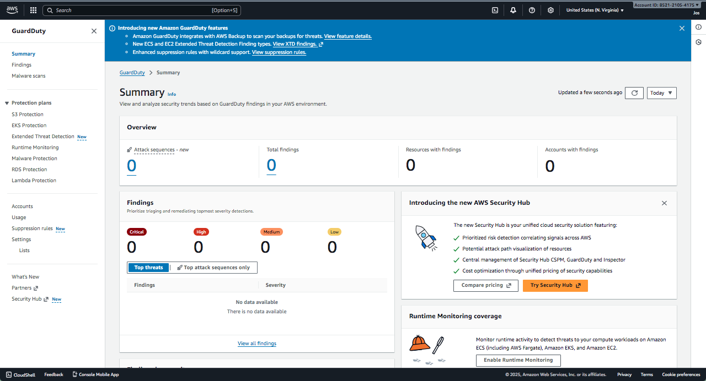
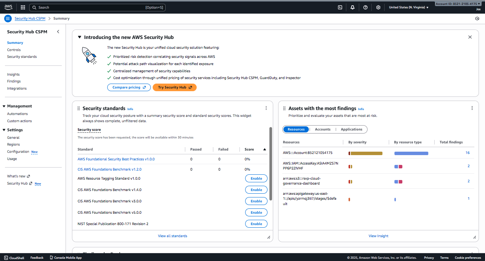
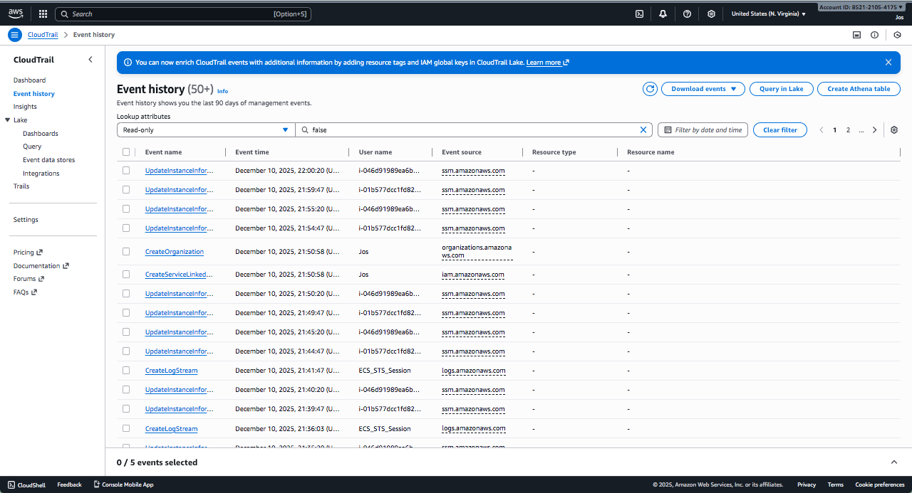
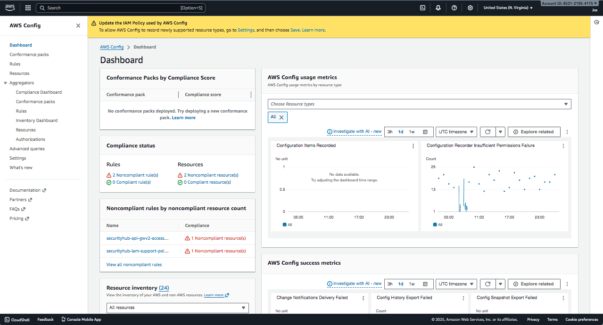

### Governance Dashboard UI
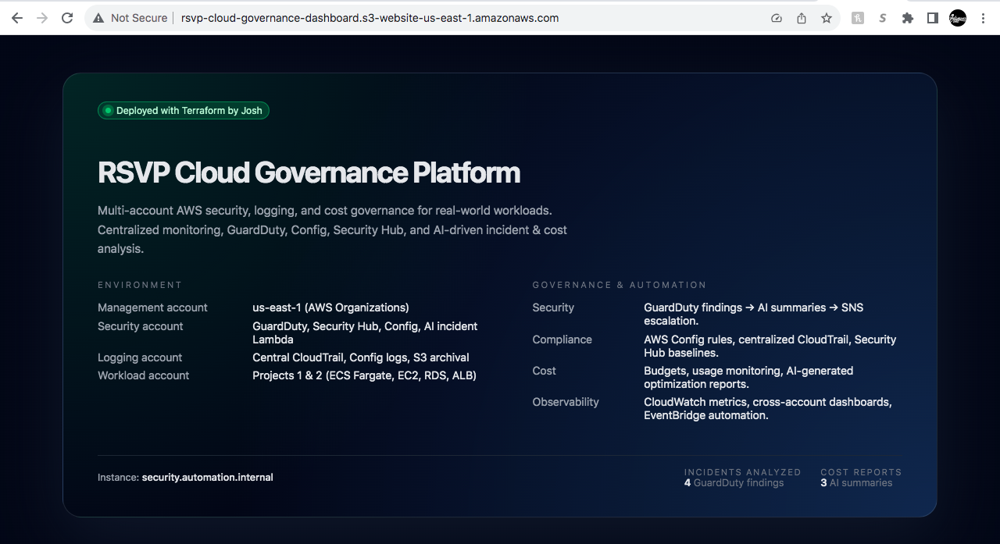
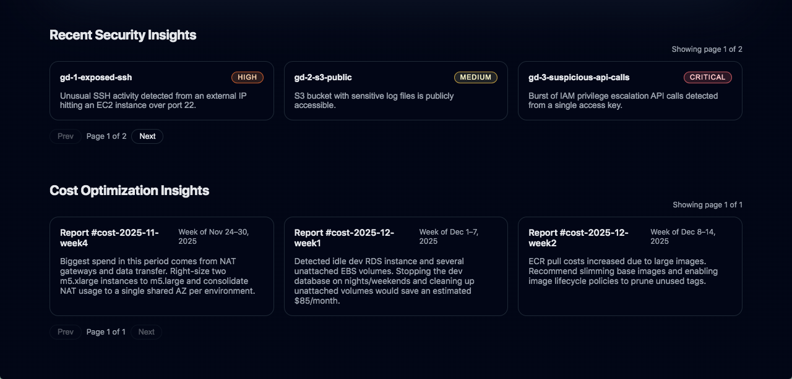

---

## Future Enhancements

- [ ] Deploy actual AWS Organizations with member accounts
- [ ] Implement SCPs for cross-account guardrails
- [ ] Add IAM Identity Center with permission sets
- [ ] Configure AWS Budgets and Cost Anomaly Detection
- [ ] Wire dashboard to live API (replace sample data)
- [ ] Automated ticket creation from AI incident summaries
- [ ] Centralized cross-account logging aggregation

---

## Technical Stack

Terraform · GuardDuty · Security Hub · AWS Config · CloudTrail · EventBridge · Lambda · OpenAI API · DynamoDB · API Gateway v2 · S3 · SNS

---

**Author:** Josh Holman  
**Region:** us-east-1
